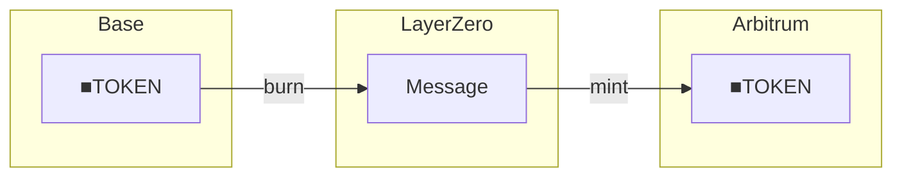

# Integrations

Cross-chain and external system integrations for 4626.

---

## Network

  
  <strong>Base L2</strong>

4626 deploys on Base for low-cost execution and fast settlement.
Base provides the security of Ethereum with significantly reduced transaction costs.

| Property | Value |
|----------|-------|
| Chain ID | 8453 |
| LZ EID | 30184 |
| Block time | ~2 seconds |
| Settlement | Ethereum L1 |

---

## Cross-chain

| Integration | Description |
|-------------|-------------|
| [LayerZero OFT](./oft) | Cross-chain share transfers |
| [Solana bridge](./solana-integration) | Solana ecosystem bridge |

---

## LayerZero OFT

■[creatorCoin] uses LayerZero's OFT standard for cross-chain transfers.

*Tokens are burned on source chain and minted on destination.*

### Supported chains

| Chain | EID | Status |
|-------|-----|--------|
| Base | 30184 | Production |
| Arbitrum | 30110 | Planned |
| Optimism | 30111 | Planned |

---

## Related

- [Token model](/overview/token-model) — ■TOKEN explained
- [CreatorShareOFT](/contracts/core/creator-share-oft) — Contract details
- [Architecture](/overview/architecture) — System overview
