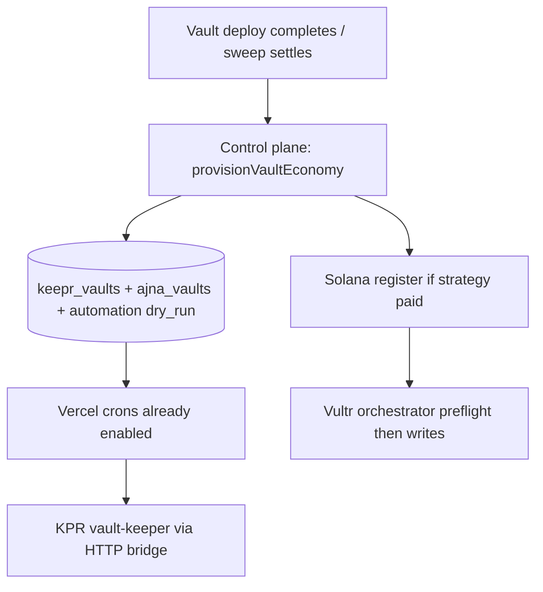

# AKITA keeper stack activation

Turn-on checklist for live vault `0x82C06EaAE27B1Ca31fA29F22341A162A670A4471` (creator `0x5b674196812451b7cec024fe9d22d2c0b172fa75`).

## Layer map

| Layer | Host | What it runs |
|-------|------|----------------|
| Control plane | **Vercel** (`akita-llc/4626`) | Crons, `/api/keeper/*`, `/api/vaults/active`, Ajna enqueue |
| Base keeper writes | **Vercel** (`KPR_PRIVATE_KEY`) | `tend` / `report` via HTTP bridge |
| Solana execution | **Vultr** (`orchestrator.4626.fun`) | `/reconcile` relay/settle/winner/rebalance |
| Local operator | **`kpr/.env`** | Dry-run + manual workflow runs against prod APIs |

## Phase 1 — Base keeper (Charm + Ajna bucket + vault tend/report)

### 1. Ship code (main production only)

Keeper stack fixes (HTTP bridge, Ajna cron, multi-adapter rebalance) must be on `main` before crons pick them up.

### 2. Vercel production env

Set in [Vercel → 4626 → Settings → Environment Variables](https://vercel.com/akita-llc/4626/settings/environment-variables):

| Variable | Value |
|----------|--------|
| `KPR_API_KEY` | Long random secret — **must be non-empty**; local `kpr/.env` must match |
| `KEEPER_AJNA_MANAGER_ENQUEUE_ENABLED` | `1` |
| `KEEPER_AJNA_MANAGER_CHAIN_ID` | `8453` |
| `KEEPER_AJNA_MANAGER_LIMIT` | `25` |
| `KEEPER_SOLANA_RECONCILE_ENABLED` | `1` (likely already set) |
| `KEEPER_SOLANA_RECONCILE_ACTIONS` | `relay_entries,settle_fees,winner_relay` (add `,rebalance` after Phase 2) |
| `SOLANA_ORCHESTRATOR_URL` | `https://orchestrator.4626.fun` (no path suffix) |
| `SOLANA_ORCHESTRATOR_API_KEY` | Same secret as Vultr orchestrator env |

Redeploy production after changes (`[force-vercel]` commit or manual promote).

### 3. Local `kpr/.env`

| Variable | Value |
|----------|--------|
| `KPR_API_BASE_URL` | `https://app.4626.fun/api` |
| `KPR_API_KEY` | Same as Vercel |
| `AJNA_BUCKET_ORACLE_ADDRESS` | `0x8C044aeF10d05bcC53912869db89f6e1f37bC6fC` |
| `CHARM_REBALANCE_ORACLE_ADDRESS` | `0x8C044aeF10d05bcC53912869db89f6e1f37bC6fC` |
| `AJNA_BUCKET_VAULT_ADDRESS` | `0x82C06EaAE27B1Ca31fA29F22341A162A670A4471` |
| `CHARM_REBALANCE_VAULT_ADDRESS` | `0x82C06EaAE27B1Ca31fA29F22341A162A670A4471` |

### 4. Verify registry auth

```bash
./scripts/ops/test-akita-keeper-stack.sh
# Expect: GET /vaults/active -> HTTP 200
```

### 5. Run Base workflows

```bash
cd kpr
pnpm exec tsx runner.ts vault-keeper --dry-run
pnpm exec tsx runner.ts vault-keeper          # live tend/report via HTTP bridge
pnpm exec tsx runner.ts ajna-bucket-manager --dry-run
pnpm exec tsx runner.ts charm-rebalance-manager --dry-run
```

Charm live path: Railway primary `strategy-signal-listener` + `keepr-action-queue`, or enable `KEEPER_STRATEGY_SIGNALS_ENABLED=1` on Vercel.

### 6. Ajna Vault Manager P0

Per `docs/operations/ajna-vault-manager-p0-runbook.md`:

1. Confirm `ajna_vaults` row exists for AKITA strategy adapter.
2. Set `automation_status = dry_run` for canary.
3. After enqueue cron runs, promote to `live` via `POST /api/deploy/v2/ajna/automation/control`.

## Phase 2 — Solana bridge (blocked until adapter registration)

**Current blocker:** AKITA is **not** registered on canonical adapter `0x700b4BBAf965c013123bAd02a6562FBa487aC0f1`.

```bash
pnpm -C frontend exec tsx scripts/verify-solana-mint-parity.ts --creator 0x5b674196812451b7cec024fe9d22d2c0b172fa75
# exit 2 = adapter_not_registered
```

### Register on Base (operator)

Run the existing provisioner / `POST /api/deploy/registerSolanaBridgeToken` path for AKITA so canonical adapter maps:

- Base creator: `0x5b674196812451b7cec024fe9d22d2c0b172fa75`
- ShareOFT: `0x4df30fFfDA1D4A81bcf4DC778292Be8Ff9752a57`
- Solana mint (strict parity): `9JWhbEAVpuHQdx1x5kSH62p6ZrWivqcBfARhvdLsLJdp`

### Vultr orchestrator env (`/etc/4626/solana-keeper-orchestrator.env`)

After registration + preflight clean:

```bash
pnpm -C kpr preflight-orchestrator   # must exit 0
```

Then on Vultr:

| Variable | Value |
|----------|--------|
| `SOLANA_KEEPER_BASE_WRITES_ENABLED` | `1` |
| `SOLANA_ORCHESTRATOR_EXECUTE` | `1` |
| `SOLANA_ORCHESTRATOR_REBALANCE_ENABLED` | `1` (when ready) |
| `SOLANA_CREATOR_MINTS` | `9JWhbEAVpuHQdx1x5kSH62p6ZrWivqcBfARhvdLsLJdp` |
| `SOLANA_SHARE_OFT_MAPPING` | mint → `0x4df30fFf…` |
| `KPR_PRIVATE_KEY` | Production keeper (`0xAb6d5…`) |

Restart: `sudo systemctl restart solana-keeper-orchestrator`

Optional hook lane: `POST /setup-creator` on provisioner for CreatorConfig PDA (warning only until hook product is live).

### Enable rebalance cron action

On Vercel, append `rebalance` to `KEEPER_SOLANA_RECONCILE_ACTIONS` and set on Vultr/local:

- `KPR_SOLANA_REBALANCE_EXECUTE=1`
- `KPR_SOLANA_REBALANCE_CREATORS_JSON` with AKITA creator + legacy adapter `0x2414…` + destination pubkey

## Quick status (2026-05-25)

| Check | Status |
|-------|--------|
| Vultr orchestrator `/healthz` | ✅ 200 |
| AKITA on canonical Solana adapter | ❌ not registered |
| ShareOFT on adapter | ❌ neither legacy nor live share registered |
| Local `KPR_API_KEY` vs Vercel | sync via `./scripts/ops/sync-kpr-env-from-vercel.sh` |
| Keeper code on `main` | ✅ shipped |
| `KEEPER_AJNA_MANAGER_*` on Vercel | ✅ enabled |

## Making this seamless (target architecture)

Today activation is manual because three things are decoupled:

1. **On-chain deploy** (vault exists)
2. **DB registry** (`keepr_vaults`, `ajna_vaults`) — empty for grandfathered vaults like AKITA
3. **Host env** (Vercel crons, Vultr orchestrator, local `kpr/.env`)

The seamless model is: **deploy completion is the only human trigger**. Everything else chains automatically.



### What to build (priority order)

| Priority | Change | Effect |
|----------|--------|--------|
| P0 | **Grandfathered vault backfill** — `scripts/ops/backfill-keepr-vault.ts` upserts AKITA into `keepr_vaults` + `ajna_vaults` from on-chain + `AKITA_DEFAULTS` | Registry stops returning 0 vaults |
| P0 | **`sync-kpr-env-from-vercel.sh`** | One command local env sync (no dashboard copy/paste) |
| P1 | **Post-settle hook** — `executeSettleVault` calls `ensureKeeperRegistryForVault` when `settlementStage=completed` | New deploys auto-seed registry if row missing |
| P1 | **Enable `KEEPER_ACTIVE_VAULT_ENQUEUE_ENABLED=1`** with `tend,report` | Crons fan out vault keeper without KPR polling registry |
| P2 | **Solana in deploy phase** — if `solana_bridge_strategy` paid, `registerSolanaBridgeToken` + provisioner run before "live" | No separate Phase 2 bridge ops |
| P2 | **Ajna default `dry_run`** on seed, promote to `live` via control-plane only | Safe-by-default automation |

### One-time AKITA backfill (grandfathered vault)

After Vercel deploy + env sync:

```bash
# Preview
pnpm -C frontend exec tsx scripts/ops/backfill-keepr-vault.ts --dry-run

# Write keepr_vaults + ajna_vaults
pnpm -C frontend exec tsx scripts/ops/backfill-keepr-vault.ts --execute

# Confirm registry
./scripts/ops/test-akita-keeper-stack.sh
```

Requires `DATABASE_URL` (same Supabase pooler URL as production API). Optional `--creator` if on-chain owner resolution differs from expected CSW.

### Operator UX today

```bash
# 1. Sync secrets (after Vercel deploy)
./scripts/ops/sync-kpr-env-from-vercel.sh

# 2. Smoke
./scripts/ops/test-akita-keeper-stack.sh

# 3. Dry-run keeper
cd kpr && pnpm exec tsx runner.ts vault-keeper --dry-run
```

New deploys that complete settlement via control plane auto-call `ensureKeeperRegistryForVault` (env `KEEPER_REGISTRY_AUTO_BOOTSTRAP_ENABLED=1`, default on).

