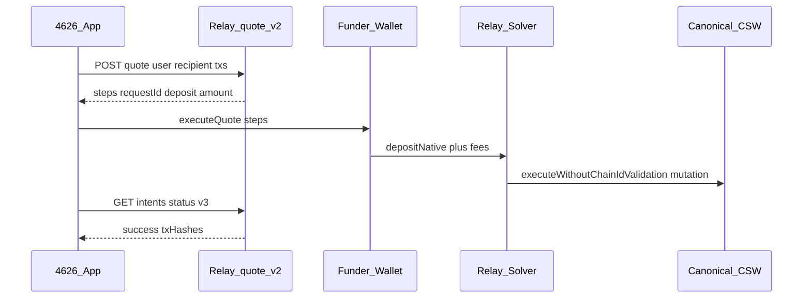

# Relay Kit — add-owner / remove-owner guide

This doc maps [relay-kit](https://github.com/relayprotocol/relay-kit), [relay-wallet-provider-examples](https://github.com/relayprotocol/relay-wallet-provider-examples) (Privy sample), and Relay Settlement API usage to **4626 CSW owner mutations** on Base mainnet.

Related runbooks:

- [Relay-Sponsored Owner Mutation Flow](/operations/relay-sponsored-owner-mutation-flow) — two-wallet architecture
- [Relay Vaults evaluation](/research/relay-vaults-evaluation) — **not** the same product as Settlement / relay-kit
- [CSW Recovery Playbook](/operations/csw-recovery-playbook) — passkey / prepared-calls recovery lanes

## Products (do not conflate)

| Product | Repo / package | Use in 4626 |
|---------|------------------|-------------|
| **Relay Settlement** | `@relayprotocol/relay-sdk`, `@relayprotocol/relay-kit-hooks` | Owner mutation funding + execution (`/quote/v2`, `executeQuote`) |
| **Relay wallet examples** | [relay-wallet-provider-examples](https://github.com/relayprotocol/relay-wallet-provider-examples) | Reference for Privy + quote + step execution |
| **Relay Vaults** | [relay-vaults](https://github.com/relayprotocol/relay-vaults) | ERC-4626 LP pools — **not** used for owner add/remove |

Bridge/swap examples in the Privy sample (`EXACT_INPUT`, cross-chain ETH) are **different** from owner-mutation quotes (`EXACT_OUTPUT`, same-chain native deposit + CSW self-call).

---

## Canonical relay-kit pattern (Settlement API)

Official flow from [relay-kit](https://github.com/relayprotocol/relay-kit) + [Privy example README](https://github.com/relayprotocol/relay-wallet-provider-examples/tree/main/privy):



### 1. Create Relay client (once per surface)

4626 pattern — [`frontend/src/lib/removeOwner/removeOwnerRelayClient.ts`](../../frontend/src/lib/removeOwner/removeOwnerRelayClient.ts):

```typescript
import { createClient, MAINNET_RELAY_API } from '@relayprotocol/relay-sdk'
import { base } from 'viem/chains'

export const relayClient = createClient({
  baseApiUrl: MAINNET_RELAY_API,
  source: '4626-remove-owner', // use a distinct source per route
  chains: [/* Base chain descriptor with viemChain: base */],
})
```

The Privy example uses server actions for `getQuote` / `getStatus` instead of relay-kit-hooks; both are valid. **4626 remove-owner uses relay-kit-hooks** (`useQuote`) which wraps the same `/quote/v2` + step execution.

### 2. Build the quote body (owner mutation shape)

This is the critical difference from bridge/swap demos.

| Field | Owner mutation value | Bridge demo value |
|-------|---------------------|-------------------|
| `user` | **Funder** address (EOA that sends the Relay deposit tx) | Connected wallet |
| `recipient` | **CSW** address (mutation executes here) | Destination recipient |
| `originChainId` / `destinationChainId` | `8453` (same-chain Base) | Often different chains |
| `originCurrency` / `destinationCurrency` | `0x000…000` (native ETH) | Token addresses |
| `tradeType` | **`EXACT_OUTPUT`** | Often `EXACT_INPUT` |
| `amount` | Relay deposit wei (from server preview / paymentDetails) | Input amount |
| `txs[0].to` | CSW | Router / bridge target |
| `txs[0].data` | `executeWithoutChainIdValidation([mutationCalldata])` | Bridge calldata |
| `txs[0].value` | `"0"` | May be non-zero |
| `subsidizeFees` | `true` (remove-owner) | Optional |
| `explicitDeposit` | `true` (server `/api/relay/quote`) | Context-dependent |

**Inner mutation calldata** must use the replay-safe wrapper:

```typescript
import { encodeExecuteWithoutChainIdValidation } from '@/lib/wallet/onboardingWalletReplayable'

const wrappedData = encodeExecuteWithoutChainIdValidation(rawMutationCalldata)
// rawMutationCalldata = addOwnerAddress(eoa) or removeOwnerAtIndex(i)
```

Live implementation: [`useRemoveOwnerFlow.ts`](../../frontend/src/features/accountSetup/removeOwner/useRemoveOwnerFlow.ts) `relayQuoteOptions`.

### 3. Fetch quote + execute

**Client (relay-kit-hooks — preferred for wallet-connected flows):**

```typescript
import { useQuote } from '@relayprotocol/relay-kit-hooks'

const { data: quote, executeQuote, refetch } = useQuote(
  relayClient,
  walletClient,
  relayQuoteOptions,
  undefined,
  undefined,
  { enabled: Boolean(relayQuoteOptions), retry: false },
)

// On submit:
await executeQuote((progress) => { /* log step progress */ })
```

This mirrors the Privy example’s manual `executeQuote({ quote, makeWalletClient, … })` in [`relay-client.ts`](https://github.com/relayprotocol/relay-wallet-provider-examples/blob/main/privy/src/app/actions/relay-client.ts) — relay-kit-hooks automates step iteration (signature + transaction items).

**Server preview (before client execute):**

- `POST /api/wallet/remove-owner/preview` (or equivalent) builds mutation calldata + calls shared [`getQuote`](../../frontend/server/_lib/relay/getQuote.ts).
- Preview returns `requestId`, `paymentDetails.depository`, `paymentDetails.amount`, and guarded `userCall`.

### 4. Poll intent status

After `executeQuote`, poll until success:

- SDK / hook progress exposes `requestId` and `txHashes`
- Fallback: `GET https://api.relay.link/intents/status/v3?requestId=…`
- 4626 helper: `pollRelayStatusEndpoint` in [`removeOwnerHelpers.ts`](../../frontend/src/lib/removeOwner/removeOwnerHelpers.ts)

**Completion criteria for owner mutations:** Relay status success **and** on-chain owner slot changed (remove-owner verifies `ownerAtIndex`).

---

## Two-wallet architecture (required for most CSW flows)

From [relay-sponsored-owner-mutation-flow](/operations/relay-sponsored-owner-mutation-flow):

| Role | Wallet | Responsibility |
|------|--------|----------------|
| **Signer** | CSW passkey / owner context | Signs inner UserOp (when using legacy handleOps path) **or** N/A when Relay solver submits destination op |
| **Funder** | External EOA (Rabby, MetaMask, etc.) | Pays Relay deposit via `executeQuote` transaction steps |

Quote must use **`user = funder`**, **`recipient = csw`**.

Coinbase in-app browser often **cannot** complete the funder lane reliably; recovery is external browser + two-session sign/submit (see runbook).

---

## Execution lanes in 4626 today

### Remove-owner — relay-kit ✅ (reference implementation)

| File | Role |
|------|------|
| [`useRemoveOwnerFlow.ts`](../../frontend/src/features/accountSetup/removeOwner/useRemoveOwnerFlow.ts) | `useQuote` + `executeQuote` |
| [`removeOwnerExecution.ts`](../../frontend/src/lib/removeOwner/removeOwnerExecution.ts) | Preflight, self-auth vs external funder branching |
| [`/api/relay/quote`](../../frontend/api/_handlers/relay/_quote.ts) | Server proxy to `/quote/v2` |
| [`getQuote.ts`](../../frontend/server/_lib/relay/getQuote.ts) | Shared quote parser for preview |

**External funder lane:** `executeQuote` from relay-kit-hooks.

**Self-auth lane** (connected wallet **is** the CSW): skip `executeQuote`; submit `depositNative(csw, requestId)` via `wallet_sendCalls` using preview-bound `paymentDetails` (see `executeRemoveOwnerViaRelay`).

### Add-owner — prepared calls primary (not relay-kit today)

| Surface | Lane | Relay? |
|---------|------|--------|
| [`/add-owner`](../../frontend/src/pages/AddOwner.tsx) | Base App `wallet_sendCalls` or `onEnable4626Signing` → `sendPreparedOwnerTx` | No |
| Waitlist / account setup | `prepare-add-privy-owner` + prepared calls | No |
| Legacy replayable | `onboardingWalletReplayable` → `/api/relay/execute` (handleOps) | Yes, **legacy** |

**When add-owner should use relay-kit:** Same conditions as remove-owner — user has an **external EOA funder** and needs Relay to sponsor the CSW `executeWithoutChainIdValidation(addOwnerAddress(...))` destination op. Reuse the remove-owner quote shape with `addOwnerAddress` calldata instead of `removeOwnerAtIndex`.

**When add-owner should NOT use relay-kit:**

- Base App CSW self-auth with working `wallet_sendCalls` / prepared calls
- Populations covered by sub-account track (`WAITLIST_SUBACCOUNT_FLOW_ENABLED`) — parent `addOwnerAddress` from third-party dapps is blocked for Base App CSWs ([owner-mutation-decision-2026-05.md](../owner-mutation-decision-2026-05.md))

### Legacy `/api/relay/execute` — avoid for product UX

[`onboardingWalletReplayable.ts`](../../frontend/src/lib/wallet/onboardingWalletReplayable.ts) builds signed `EntryPoint.handleOps` UserOps and posts to `/api/relay/execute` (`/execute/call`). This was the March-9 recovery path.

**Do not** use as the default user-facing lane when relay-kit `executeQuote` + deposit flow is available. Keep for diagnostics / dev probes only.

---

## Server-side API key

Set on Vercel (`akita-llc/4626`):

| Env | Purpose |
|-----|---------|
| `RELAY_API_KEY` | Rate limits + reliability for `/quote/v2` |

4626 proxies attach `x-api-key` ([`_quote.ts`](../../frontend/api/_handlers/relay/_quote.ts)). The Privy example uses `Authorization: Bearer` — Relay accepts both; keep server key **server-side only** (never `VITE_*`).

Optional: register app source strings (`4626-remove-owner`, future `4626-add-owner`) in [Relay dashboard](https://dashboard.relay.link/).

---

## Privy integration checklist

From [relay-wallet-provider-examples/privy](https://github.com/relayprotocol/relay-wallet-provider-examples/tree/main/privy):

1. **Auth:** Privy + `@privy-io/wagmi` — 4626 already uses this on app routes.
2. **Wallet client:** `useWalletClient()` must reflect the **funder** EOA, not the CSW display address.
3. **Chain switch:** Privy example’s `makeWalletClient(chain)` switches before each step — relay-kit-hooks handles this when `viemChain` is set on the Relay chain descriptor.
4. **Signing steps:** Bridge quotes may include EIP-712 signature steps; owner-mutation same-chain native deposits are usually **transaction-only** steps. If Relay returns a signature step, relay-kit-hooks / `executeQuote` handles it.
5. **Status polling:** After execute, poll `/intents/status/v3` until `success` or terminal failure.

---

## Implementation checklist (new owner mutation surface)

Use this when adding relay-backed add-owner or similar:

- [ ] Server preview builds raw CSW mutation calldata (`addOwnerAddress` / `removeOwnerAtIndex`)
- [ ] Wrap with `encodeExecuteWithoutChainIdValidation`
- [ ] Fetch Relay quote with `user=funder`, `recipient=csw`, `tradeType=EXACT_OUTPUT`
- [ ] Return `requestId`, `paymentDetails`, and simulation preflight from preview API
- [ ] Client: `createClient` + `useQuote` + `executeQuote` (external funder)
- [ ] Client self-auth branch: `depositNative` via `wallet_sendCalls` bound to preview `requestId`
- [ ] Poll intent status; verify **on-chain owner slot** changed
- [ ] Do not use `/api/relay/execute` + hand-built `handleOps` for default UX
- [ ] Gate Base App CSW users to sub-account track when product policy requires it

---

## Quick reference — copy/paste quote skeleton

```typescript
import type { paths } from '@relayprotocol/relay-sdk'
import { encodeExecuteWithoutChainIdValidation } from '@/lib/wallet/onboardingWalletReplayable'

type RelayQuoteBody = paths['/quote/v2']['post']['requestBody']['content']['application/json']

function buildOwnerMutationQuoteOptions(params: {
  funderAddress: `0x${string}`
  cswAddress: `0x${string}`
  mutationCalldata: `0x${string}`
  depositAmountWei: string // decimal string from preview.relay.paymentDetails.amount
}): RelayQuoteBody {
  return {
    user: params.funderAddress,
    recipient: params.cswAddress,
    originChainId: 8453,
    destinationChainId: 8453,
    originCurrency: '0x0000000000000000000000000000000000000000',
    destinationCurrency: '0x0000000000000000000000000000000000000000',
    tradeType: 'EXACT_OUTPUT',
    amount: params.depositAmountWei,
    originGasOverhead: 300000,
    subsidizeFees: true,
    txs: [
      {
        to: params.cswAddress,
        data: encodeExecuteWithoutChainIdValidation(params.mutationCalldata),
        value: '0',
      },
    ],
  }
}
```

Shared module: [`frontend/src/lib/relay/ownerMutationRelayKit.ts`](../../frontend/src/lib/relay/ownerMutationRelayKit.ts).

---

## Recommended next steps

1. **Keep `/remove-owner` as the relay-kit reference** — it already matches Privy example + relay-kit docs.
2. **Add relay-kit lane to `/add-owner`** for external-EOA funders only (mirror remove-owner); keep prepared-calls / sendCalls for passkey self-auth.
3. **Do not** route waitlist Base App users through parent-CSW `addOwnerAddress` when sub-account flag is on.
4. **Retire** user-facing dependence on `/api/relay/execute` once add-owner uses the same deposit + `executeQuote` path.
