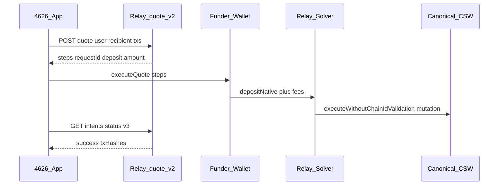

# Relay Kit — add-owner / remove-owner guide

This doc maps [relay-kit](https://github.com/relayprotocol/relay-kit), [relay-wallet-provider-examples](https://github.com/relayprotocol/relay-wallet-provider-examples) (Privy sample), and Relay Settlement API usage to **4626 CSW owner mutations** on Base mainnet.

Related runbooks:

- [Owner-install reference methods](/operations/owner-install-reference-methods) — **Method A/B/C index** + golden txs (primary vs reference lanes)
- [Base App session-key Relay Part 1 recipe](/operations/base-app-session-key-relay-part1-recipe) — **Method B** (passkey-first Base App; reference, not sole success path)
- [Relay-Sponsored Owner Mutation Flow](/operations/relay-sponsored-owner-mutation-flow) — two-wallet architecture
- [Relay Vaults evaluation](/research/relay-vaults-evaluation) — **not** the same product as Settlement / relay-kit
- [CSW Recovery Playbook](/operations/csw-recovery-playbook) — **Method C** passkey / prepared-calls recovery lane

## Products (do not conflate)

| Product | Repo / package | Use in 4626 |
|---------|------------------|-------------|
| **Relay Settlement** | `@relayprotocol/relay-sdk` (server legacy execute proxy only) | Owner mutation funding + execution via `/quote/v2` + manual deposit |
| **Relay wallet examples** | [relay-wallet-provider-examples](https://github.com/relayprotocol/relay-wallet-provider-examples) | Reference for Privy + quote + step execution |
| **Relay Vaults** | [relay-vaults](https://github.com/relayprotocol/relay-vaults) | ERC-4626 LP pools — **not** used for owner add/remove |

Bridge/swap examples in the Privy sample (`EXACT_INPUT`, cross-chain ETH) are **different** from owner-mutation quotes (`EXACT_OUTPUT`, same-chain native deposit + CSW self-call).

---

## Golden reference transactions (Base mainnet)

> **Method A (primary).** For the full method index (including passkey-first Base App **Method B** and recovery **Method C**), see [Owner-install reference methods](/operations/owner-install-reference-methods).

Successful **add embedded EOA owner** via Relay on block **45600637** (May 5, 2026). Part 1 and Part 2 landed in the same block.

| Part | Hash | Role |
| --- | --- | --- |
| **1 — User deposit (UserOp)** | [0xa6b54357…b4c3](https://basescan.org/tx/0xa6b5435718a8969905a08093a7208dadefdf702602c63e3fd322d84db5f4b4c3) | CSW UserOp → `executeBatch` → `Depository.depositNative(depositor=CSW, orderId=0x8cc58ae3…797a)` with **18871666861048 wei** (reference at block 45600637; live quotes may be higher) |
| **1 — Bundle wrapper** | [0x34edd28…2aadf](https://basescan.org/tx/0x34edd28dd9611f4e06374dfe87645de4fc3fd94c83f96b5b1406c6ee10d2aadf) | Outer Base bundle tx that includes the UserOp (what some wallets/explorers label separately from the AA hash) |
| **2 — Solver fill** | [0xa9a06340…9a36](https://basescan.org/tx/0xa9a06340a7725063f1dd9b0a29af6c72f4fbfe3a408b28dd28e2fd2db7649a36) | Relay solver → `EntryPoint.handleOps` → CSW `executeWithoutChainIdValidation` → **`addOwnerAddress(newOwner)`** |

**Basescan internal txs (Part 1 UserOp `0xa6b54357…`):**

1. CSW → EntryPoint v0.6 — ~**85989948096 wei** (UserOp gas prefund)
2. CSW → Relay Depository `0x4cd00e38…` — **18871666861048 wei** + `depositNative` calldata

**Relay explorer presentation:** Even though `originChainId` and `destinationChainId` are both **8453**, Relay's intent UI labels this a **same-chain cross-chain transaction** (~**0.000019 ETH** native on Base → **0 ETH** destination leg on Base). That is expected for Relay call-execution / intent settlement — not a bridge to another chain.

Observed on Part 2 (CSW `0x4beabd0…`, probe `4626.base.eth`):

- Router: `0xb92fe925DC43a0ECdE6c8b1a2709c170Ec4fFf4f`
- Selector: `multicall` (`0xcd6e13f7`)
- `refundTo` / `nftRecipient`: the CSW (self-auth deposit lane)
- Event: `AddOwner` with new owner EOA at owner index 33
- Paymaster: `0x0` on the destination UserOp (self-funded)

**Method B Part 2 reference (historical, passkey-first CSW):** [0x801b9d4b…91503](https://basescan.org/tx/0x801b9d4b8f7470226c2f02d5252583f00d77da5cbb0b7dc8b73421ed8b491503) on the same probe CSW — passkey `owner[0]` validates via `getUserOpHashWithoutChainId` (`org.toshi`); inner call added session-key `0xCf8D17…0142` at index **2**. Use for Part 2 signing-shape reference only; waitlist success still requires `isOwnerAddress(privyEmbeddedEoa)`. [Tenderly trace](https://dashboard.tenderly.co/tx/0x801b9d4b8f7470226c2f02d5252583f00d77da5cbb0b7dc8b73421ed8b491503).

4626 replicates Part 1 by:

1. Server `/quote/v2` with `user = depositor` (CSW for self-auth), `recipient = mutation CSW`, wrapped `executeWithoutChainIdValidation(addOwnerAddress(embeddedEoa))`, **`originChainId = destinationChainId = 8453`**, `tradeType = EXACT_OUTPUT`.
2. Client submits preview **`userCall`** = Depository `depositNative` (`0x49290c1c`) via Base App **`wallet_sendCalls` first** (May 12 golden path). If sendCalls fails, fall back to **`wallet_prepareCalls` → strip injected paymaster → `wallet_sendPreparedCalls`**, then direct self-funded bundler UserOp when needed. Do not attach a paymaster URL for Part 1 — Relay Part 2 stalls when Base App injects USDC sponsorship on the deposit UserOp.
3. Poll `/intents/status/v3` with `orderId ?? requestId`; verify on-chain `isOwnerAddress(embeddedEoa)`.

Implementation: `buildOwnerMutationRelayFlow.ts`, `ownerMutationExecution.ts`, `submitRelayPart1SelfFunded.ts`.

---

## Canonical relay-kit pattern (Settlement API)

Official flow from [relay-kit](https://github.com/relayprotocol/relay-kit) + [Privy example README](https://github.com/relayprotocol/relay-wallet-provider-examples/tree/main/privy):



### 1. Server quote (4626 pattern)

Production flows do **not** create a browser Relay SDK client. Server preview handlers call [`getQuote.ts`](../../frontend/server/_lib/relay/getQuote.ts) via [`buildOwnerMutationRelayFlow.ts`](../../frontend/server/_lib/relay/buildOwnerMutationRelayFlow.ts) and return a preview-bound `relay.userCall`.

The Privy example uses server actions for `getQuote` / `getStatus` plus manual deposit step iteration. **4626 matches that pattern.**

### 2. Build the quote body (owner mutation shape)

This is the critical difference from bridge/swap demos.

| Field | Owner mutation value | Bridge demo value |
|-------|---------------------|-------------------|
| `user` | **Funder** address (EOA that sends the Relay deposit tx) | Connected wallet |
| `recipient` | **CSW** address (mutation executes here) | Destination recipient |
| `originChainId` / `destinationChainId` | `8453` (same-chain Base) | Often different chains |
| `originCurrency` / `destinationCurrency` | `0x000…000` (native ETH) | Token addresses |
| `tradeType` | **`EXACT_OUTPUT`** | Often `EXACT_INPUT` |
| `amount` | **`"0"`** — EXACT_OUTPUT destination value (`txs[0].value`). Relay prices Part 1 in `protocol.v2.paymentDetails.amount` (authoritative). Ops debug override: `RELAY_ADD_OWNER_QUOTE_OUTPUT_WEI` / `RELAY_REMOVE_OWNER_QUOTE_OUTPUT_WEI`. | Input amount |
| `txs[0].to` | CSW | Router / bridge target |
| `txs[0].data` | `executeWithoutChainIdValidation([mutationCalldata])` | Bridge calldata |
| `txs[0].value` | `"0"` | May be non-zero |
| `explicitDeposit` | **`true`** (CSW / smart-wallet lane) | `false` for EOAs |
| `subsidizeFees` | **`true`** (solver sponsorship when configured) | Optional |
| `originGasOverhead` | **`300_000`** | Optional |

**Inner mutation calldata** must use the replay-safe wrapper:

```typescript
import { encodeExecuteWithoutChainIdValidation } from '@/lib/wallet/cswOwnerMutationEncode'

const wrappedData = encodeExecuteWithoutChainIdValidation(rawMutationCalldata)
// rawMutationCalldata = addOwnerAddress(eoa) or removeOwnerAtIndex(i)
```

Live implementation: [`useRemoveOwnerFlow.ts`](../../frontend/src/features/accountSetup/removeOwner/useRemoveOwnerFlow.ts) + [`useAddOwnerFlow.ts`](../../frontend/src/features/accountSetup/addOwner/useAddOwnerFlow.ts).

### 3. Fetch quote + execute

**4626 production pattern (matches Privy manual `executeQuote`):**

1. Server preview calls `POST /quote/v2` via [`getQuote.ts`](../../frontend/server/_lib/relay/getQuote.ts) and returns `relay.userCall` + `requestId`.
2. Client submits that **exact** deposit transaction:
   - **Self-auth CSW:** `wallet_sendCalls` with preview `userCall` ([`ownerMutationExecution.ts`](../../frontend/src/lib/relay/ownerMutationExecution.ts))
   - **External funder:** `eth_sendTransaction` with preview `userCall`
3. Poll `GET /intents/status/v3?requestId=…` via `pollRelayStatusEndpoint`.
   - Poll id is **`orderId ?? requestId`** (must match the bytes32 bound to `depositNative`).
   - If the primary id returns `unknown` and both ids differ, retry once with `requestId`.
   - Treat Relay `unknown` as terminal (stale/wrong quote) — rebuild preview.
   - During polling, short-circuit success when on-chain owner state already matches the mutation.
4. Verify on-chain owner state (authoritative). Fill-tx selector checks are diagnostic only when verify fails.

Bridge integrations may use `@relayprotocol/relay-kit-hooks`; 4626 owner mutations do not.

### 4. Poll intent status

After `executeQuote`, poll until success:

- SDK / hook progress exposes `requestId` and `txHashes`
- Fallback: `GET https://api.relay.link/intents/status/v3?requestId=…` using **`orderId ?? requestId`** from preview (same id embedded in `depositNative`)
- 4626 helper: `pollRelayStatusEndpoint` + `resolveRelayStatusRequestId` in [`removeOwnerHelpers.ts`](../../frontend/src/lib/removeOwner/removeOwnerHelpers.ts)

**Completion criteria for owner mutations:** on-chain owner slot changed (`verifyMutation`). Relay status success is best-effort; if status stalls but on-chain verify passes, the flow still succeeds.

---

## Two-wallet architecture (required for most CSW flows)

From [relay-sponsored-owner-mutation-flow](/operations/relay-sponsored-owner-mutation-flow):

| Role | Wallet | Responsibility |
|------|--------|----------------|
| **Signer** | CSW passkey / owner context | Signs inner UserOp (when using legacy handleOps path) **or** N/A when Relay solver submits destination op |
| **Funder** | External EOA (Rabby, MetaMask, etc.) | Pays Relay deposit via `executeQuote` transaction steps |

Quote must use **`user = funder`**, **`recipient = csw`**.

Coinbase in-app browser often **cannot** complete the funder lane reliably; recovery is external browser + two-session sign/submit (see runbook).

---

## Execution lanes in 4626 today

### Remove-owner — Relay preview + execute ✅ (reference implementation)

| File | Role |
|------|------|
| [`useRemoveOwnerFlow.ts`](../../frontend/src/features/accountSetup/removeOwner/useRemoveOwnerFlow.ts) | Server preview + `executeRemoveOwnerViaRelay` |
| [`removeOwnerExecution.ts`](../../frontend/src/lib/removeOwner/removeOwnerExecution.ts) | Delegates to shared `executeOwnerMutationViaRelay` |
| [`buildOwnerMutationRelayFlow.ts`](../../frontend/server/_lib/relay/buildOwnerMutationRelayFlow.ts) | Server `/quote/v2` with `explicitDeposit` + wrapped mutation |
| [`getQuote.ts`](../../frontend/server/_lib/relay/getQuote.ts) | Shared Relay quote parser |
| [`/api/relay/quote`](../../frontend/api/_handlers/relay/_quote.ts) | Legacy deposit-discovery proxy |

**Note:** Server-bound preview quotes + manual deposit submission, then `/intents/status/v3` polling.

### Add-owner — Relay preview + execute ✅ (same kit as remove-owner)

| Surface | Lane | Relay? |
|---------|------|--------|
| [`/add-owner`](../../frontend/src/pages/AddOwner.tsx) | `useAddOwnerFlow` → server preview → `executeAddOwnerViaRelay` | Yes |
| Waitlist sub-account (`SubAccountOwnerInstallPanel`, `WaitlistConnectBaseApp`) | Same `useAddOwnerFlow` with `targetCswAddress = subAccount` | Yes |
| Legacy prepared calls | `prepare-add-privy-owner` + `sendPreparedOwnerTx` where still wired | No |
| Legacy replayable | `onboardingWalletReplayable` → `/api/relay/execute` (handleOps) | Yes, **legacy** |

**Self-auth (Base App CSW):** `user = recipient = CSW`, `explicitDeposit: true`, submit preview-bound `userCall` via Base Account SDK `wallet_sendCalls` (not relay-kit `executeQuote` — same manual deposit lane as remove-owner).

**Sub-account track:** mutation `recipient` is the app sub-account CSW, but Relay deposit `user` / depositor is the **parent custody CSW** (where ETH usually lives). Client self-auth signs with the parent wallet via `wallet_sendCalls`.

**External funder:** `user = funder EOA`, `recipient = CSW`; submit preview `userCall` via `eth_sendTransaction`.

**When add-owner should NOT use Relay parent-CSW mutation:**

- Sub-account track users where product policy blocks third-party parent `addOwnerAddress` ([owner-mutation-decision-2026-05.md](../owner-mutation-decision-2026-05.md)) — Relay targets the **sub-account CSW**, not the parent.

### Legacy `/api/relay/execute` — avoid for product UX

[`onboardingWalletReplayable.ts`](../../frontend/src/lib/wallet/onboardingWalletReplayable.ts) builds signed `EntryPoint.handleOps` UserOps and posts to `/api/relay/execute` (`/execute/call`). This was the March-9 recovery path.

**Do not** use as the default user-facing lane when server preview + deposit flow is available. Keep for diagnostics / dev probes only.

Ops script for canonical deposit lane: [`scripts/relay-add-embedded-owner.ts`](../../frontend/scripts/relay-add-embedded-owner.ts).

---

## Server-side API key

Set on Vercel (`akita-llc/4626`):

| Env | Purpose |
|-----|---------|
| `RELAY_API_KEY` | Rate limits + reliability for `/quote/v2` |

4626 proxies attach `x-api-key` ([`_quote.ts`](../../frontend/api/_handlers/relay/_quote.ts)). The Privy example uses `Authorization: Bearer` — Relay accepts both; keep server key **server-side only** (never `VITE_*`).

Optional: register app source strings (`4626-remove-owner`, future `4626-add-owner`) in [Relay dashboard](https://dashboard.relay.link/).

---

## Privy integration checklist

From [relay-wallet-provider-examples/privy](https://github.com/relayprotocol/relay-wallet-provider-examples/tree/main/privy):

1. **Auth:** Privy + `@privy-io/wagmi` — 4626 already uses this on app routes.
2. **Wallet client:** `useWalletClient()` must reflect the **funder** EOA for external-funder lanes, or Base Account SDK for self-auth CSW.
3. **Signing steps:** Owner-mutation same-chain native deposits are usually **transaction-only** steps.
4. **Status polling:** After deposit submit, poll `/intents/status/v3` until `success` or terminal failure.

---

## Implementation checklist (new owner mutation surface)

Use this when adding relay-backed add-owner or similar:

- [ ] Server preview builds raw CSW mutation calldata (`addOwnerAddress` / `removeOwnerAtIndex`)
- [ ] Wrap with `encodeExecuteWithoutChainIdValidation` from [`cswOwnerMutationEncode.ts`](../../frontend/src/lib/wallet/cswOwnerMutationEncode.ts)
- [ ] Fetch Relay quote with `user=funder`, `recipient=csw`, `tradeType=EXACT_OUTPUT`, `explicitDeposit=true`
- [ ] Return `requestId`, `paymentDetails`, and simulation preflight from preview API
- [ ] Client self-auth: submit preview `userCall` via Base Account SDK `wallet_sendCalls`
- [ ] Client external funder: submit preview `userCall` via `eth_sendTransaction`
- [ ] Poll intent status; verify **on-chain owner slot** changed
- [ ] Do not use `/api/relay/execute` + hand-built `handleOps` for default UX
- [ ] Gate Base App CSW users to sub-account track when product policy requires it

---

## Quick reference — quote payload fields

See [`getQuote.ts`](../../frontend/server/_lib/relay/getQuote.ts) and [`buildOwnerMutationRelayFlow.ts`](../../frontend/server/_lib/relay/buildOwnerMutationRelayFlow.ts). Wrap helper: [`cswOwnerMutationEncode.ts`](../../frontend/src/lib/wallet/cswOwnerMutationEncode.ts).

---

## Recommended next steps

1. **Keep server-preview + manual deposit as the canonical lane** for add-owner and remove-owner — it matches [Privy relay-client.ts](https://github.com/relayprotocol/relay-wallet-provider-examples/blob/main/privy/src/app/actions/relay-client.ts) and Relay call-execution docs.
2. **Sub-account Relay deposits fund from the parent CSW** — counterfactual app wallets often have 0 ETH; preview quotes use `relayQuoteUser = parentCswAddress` while mutation still targets the sub-account.
3. **Do not** route waitlist Base App users through parent-CSW `addOwnerAddress` when sub-account flag is on.
4. **Retire** user-facing dependence on `/api/relay/execute` (legacy handleOps) once all owner-mutation surfaces stay on deposit + solver fill.
5. **Optional:** If same-chain quotes succeed but destination ops stall, try `forceSolverExecution: true` on `/quote/v2` (Relay docs: forces solver execution for same-chain swap requests; evaluate for call-execution if needed).
