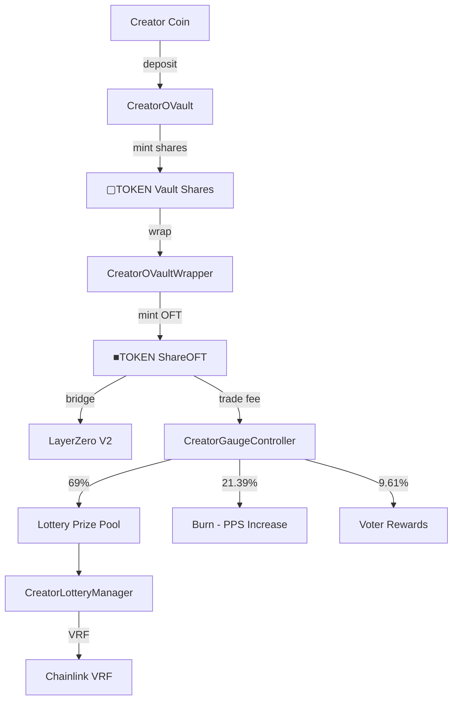

# System Architecture

CreatorVault's architecture is built for **provenance, identity, and execution**.

## System Components

Onchain, CreatorVault consists of:

- **Shared infrastructure** (deployed once per chain, referenced via `CreatorRegistry`)
- **Per-creator vault stack** (deployed per creator coin)
- **Optional incentives layer** (ve(3,3) voting, voter rewards, bribes)

## Contract Relationships



## Deployment Flow

```
User clicks "Deploy" → wallet/bundler executes a phased sequence

Phase 1 — Deterministic deploy (CreatorVaultDeployer):
- Deploy per-creator contracts
- Register in CreatorRegistry

Phase 2 — Configuration:
- Wire roles + addresses
- Set required approvals

Phase 3 — Activation + launch:
- Deposit → wrap → start CCA
- Execute via VaultActivationBatcher
```

## Hub Chain Model

**Base is the hub chain** - all deployments start on Base, then OFT can be bridged to other chains.

### Cross-Chain Flow

1. Deploy vault, wrapper, OFT on Base
2. Configure lottery and gauge controller
3. Start CCA auction
4. Users bridge ■TOKEN via LayerZero V2
5. Trading on any chain triggers lottery entries
6. Winners notified cross-chain via LayerZero
