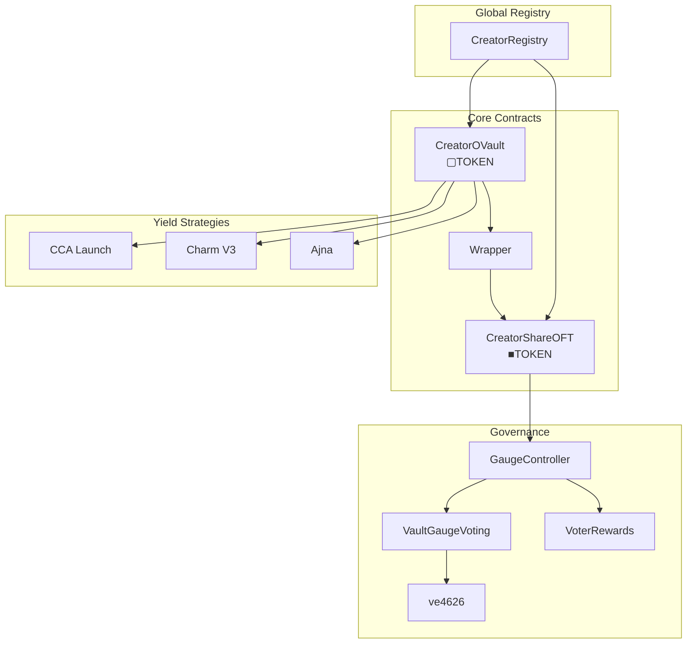
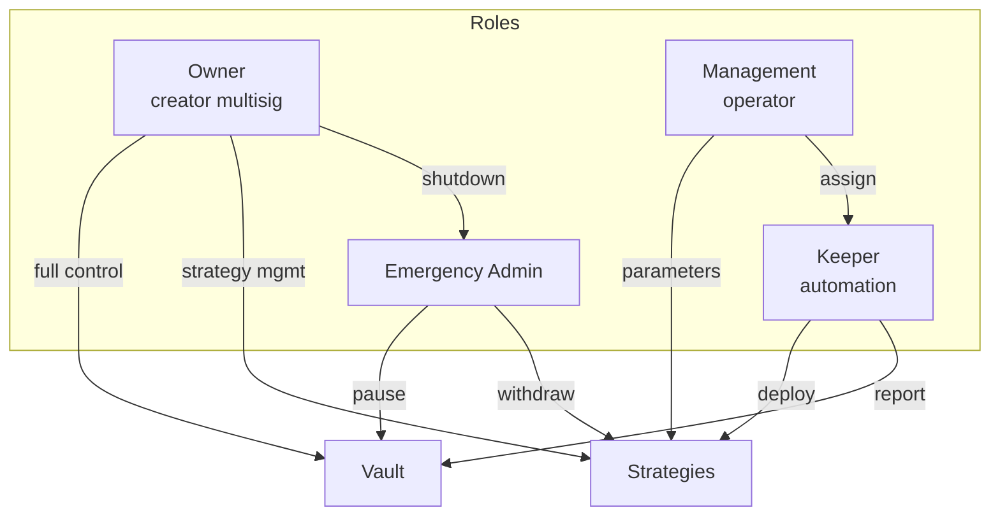

# System architecture

Contract hierarchy and relationships in the 4626 protocol.

---

## Contract hierarchy

**Legend:** ▢ = vault shares, ■ = wrapped OFT shares

---

## Core contracts

| Contract | Purpose | Documentation |
|----------|---------|---------------|
| CreatorOVault | ERC-4626 vault, issues ▢TOKEN | [Details](/contracts/core/creator-ovault) |
| CreatorOVaultWrapper | Converts ▢TOKEN ↔ ■TOKEN | [Details](/contracts/core/creator-ovault-wrapper) |
| CreatorShareOFT | LayerZero OFT, collects fees | [Details](/contracts/core/creator-share-oft) |
| CreatorRegistry | Global registry | [API](/api/contracts) |

---

## Supporting systems

| System | Canonical documentation |
|--------|------------------------|
| Fee distribution | [Fee Flow](/overview/fee-flow) |
| Strategies | [Strategies](/contracts/strategies) |
| Governance | [Governance](/governance) |
| Cross-chain | [LayerZero OFT](/integrations/oft) |
| Security | [Vault Concepts](/concepts/vault) |

---

## Access control

---

## Deployment addresses

See [Reference: Addresses](/reference/addresses).
