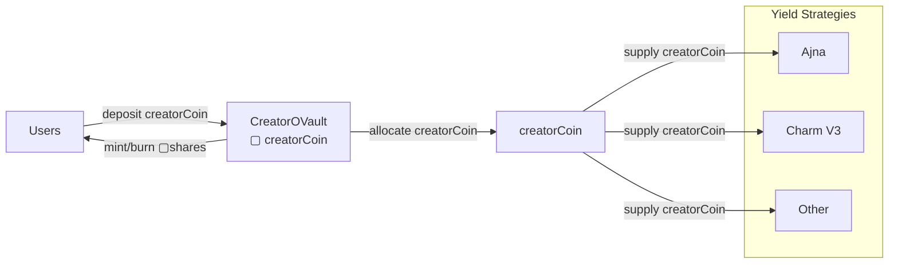
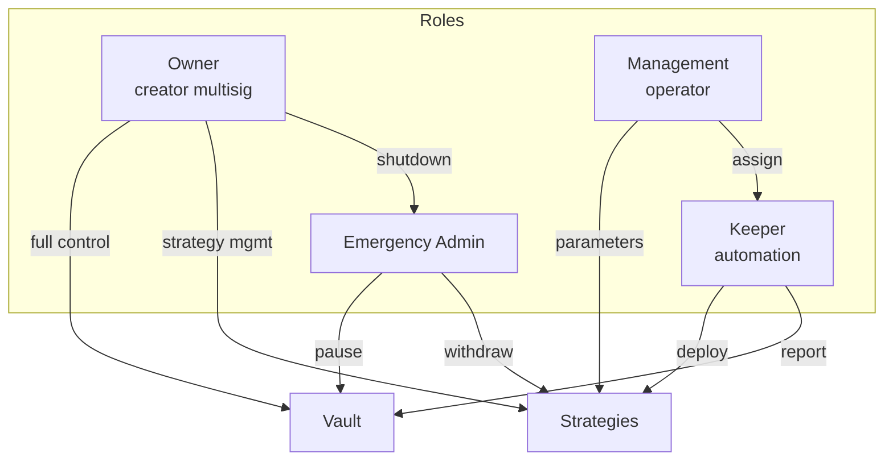

# System architecture

Contract hierarchy and relationships in the 4626 protocol.

  
  Deployed on Base (Chain ID: 8453)

---

## Asset and strategy flow

This is the canonical diagram for understanding how assets move through the system.

### Legend

| Symbol | Meaning |
|--------|---------|
| **creatorCoin** | Underlying ERC-20 asset (the only thing strategies receive) |
| **▢[creatorCoin]** | ERC-4626 vault shares (accounting only, never enters strategies) |
| **■[creatorCoin]** | Wrapped OFT representation (bridging and UX, never enters strategies) |

> **Invariant:** Yield strategies operate exclusively on the underlying creatorCoin.
> Vault shares (▢[creatorCoin]) and wrapped OFT shares (■[creatorCoin]) are accounting and representation layers only and are never deposited into strategies.

---

## Layer separation

The protocol has three orthogonal layers:

### Asset layer

The underlying creatorCoin (ERC-20) is the only asset that moves between contracts. When users deposit, the vault receives creatorCoin. When strategies deploy capital, they receive creatorCoin. All yield is generated on creatorCoin.

### Accounting layer

- **CreatorOVault** issues ▢[creatorCoin] as receipt tokens for deposits
- **CreatorShareOFT** wraps ▢[creatorCoin] into ■[creatorCoin] for trading and bridging

These tokens track ownership but never leave the accounting layer. Strategies are unaware of their existence.

### Yield execution layer

Strategies (Ajna, Charm, etc.) receive creatorCoin from the vault, deploy it to external protocols, and return creatorCoin (plus yield) when harvested.

---

## Core contracts

| Contract | Purpose | Documentation |
|----------|---------|---------------|
| CreatorOVault | ERC-4626 vault, issues ▢TOKEN | [Details](/contracts/core/creator-ovault) |
| CreatorOVaultWrapper | Converts ▢TOKEN ↔ ■TOKEN | [Details](/contracts/core/creator-ovault-wrapper) |
| CreatorShareOFT | LayerZero OFT, collects fees | [Details](/contracts/core/creator-share-oft) |
| CreatorRegistry | Global registry | [API](/api/contracts) |

---

## Supporting systems

| System | Canonical documentation |
|--------|------------------------|
| Fee distribution | [Fee Flow](/overview/fee-flow) |
| Strategies | [Strategies](/contracts/strategies) |
| Governance | [Governance](/governance) |
| Cross-chain | [LayerZero OFT](/integrations/oft) |
| Security | [Vault Concepts](/concepts/vault) |

---

## Access control

---

## Deployment addresses

See [Reference: Addresses](/reference/addresses).
