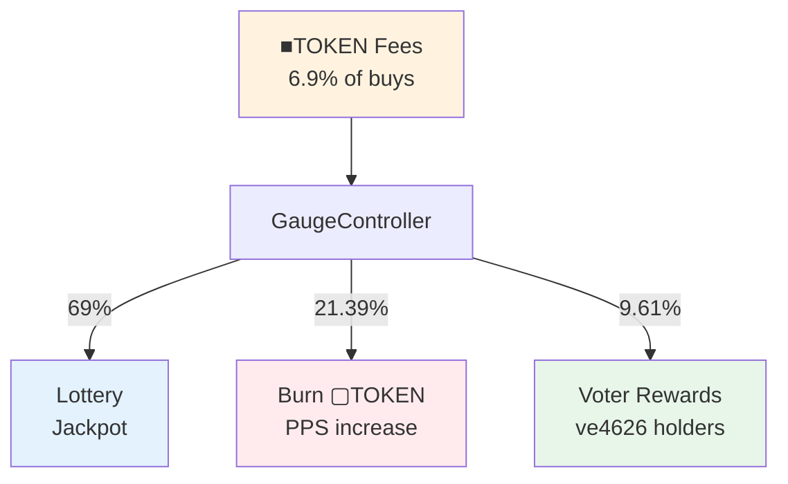

# Fee flow

How fees are collected and distributed in the 4626 protocol.

---

## Fee sources

### Buy fee (6.9%)

When users buy ■TOKEN on a DEX, a 6.9% fee is collected and sent to GaugeController.

The ShareOFT classifies addresses to detect buys:
- `SwapOnly` addresses (DEX pools/routers) trigger fees on outgoing transfers
- `NoFees` addresses (vault, controller) are exempt

### V4 tax hook

For Uniswap V4 pools, a tax hook collects 6.9% in WETH, which is converted to ▢TOKEN for distribution.

---

## Distribution

| Recipient | Percentage | Effect |
|-----------|------------|--------|
| Lottery | 69% | Funds jackpot for random prizes |
| Burn | 21.39% | Burns shares, increases PPS |
| Voters | 9.61% | Weekly rewards for ve4626 voters |

---

## Lottery allocation

69% of fees fund the lottery jackpot. Buyers automatically enter. See [Lottery](/concepts/lottery) for mechanics.

---

## Burn allocation

21.39% is unwrapped to ▢TOKEN and burned, increasing price-per-share for all holders.

---

## Voter allocation

9.61% goes to VoterRewardsDistributor. Voters claim pro-rata after each epoch. See [Governance](/governance) for details.

---

## Day-1 configuration

Before governance is activated:

| Setting | Value | Effect |
|---------|-------|--------|
| `voterRewardsDistributor` | `address(0)` | 9.61% goes to treasury |
| `vaultGaugeVoting` | `address(0)` | No vote-directed probability |

Treasury accumulates until governance activates.

---

## Related

- [Lottery](/concepts/lottery) - Jackpot mechanics
- [Governance](/governance) - Voting system
- [GaugeController](/contracts/governance/gauge-controller) - Contract API
