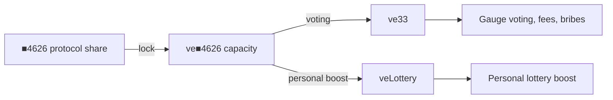

# ve■4626, ve33, and veLottery

Lock **■4626** to create decaying **ve■4626** power. Assign it to **ve33** (voting) or **veLottery** (personal lottery boost) — or split between both.

Lock ■4626 → choose a utility → stay within decaying capacity. The lock asset and the creator `■TICKER` that covers a trade are different tokens.

## Journey

1. **Acquire ■4626** — protocol ShareOFT, not a creator’s `■TICKER`.
2. **Lock** — creates decaying ve■4626 capacity.
3. **Assign** — ve33 and/or veLottery; total never exceeds remaining capacity.
4. **Sync** — as the lock decays, excess utility is removed (veLottery first, then ve33).

## Names

| Name | Means | Does not mean |
|------|-------|---------------|
| **ve■4626** | Decaying power from locking ■4626 | A transferable token |
| **ve33** | Voting / fees / bribes utility | Personal lottery odds |
| **veLottery** | Opt-in personal lottery utility | Vault-wide gauge vote |

`veChance` / `veVote` are retired names.

## Two balances

| Balance | Role |
|---------|------|
| Locked **■4626** → veLottery | Your share of live ve power |
| Traded creator’s **■TICKER** | Coverage for that trade’s uplift |

Holding `■TICKER` does not create ve■4626. Locking ■4626 does not cover every creator trade.

## Personal boost

Raw multiplier is Curve-style, **1.0×–2.5×**. Only the covered portion of the uplift applies:

| Situation | Result |
|-----------|--------|
| No veLottery or no creator-share coverage | **1.0×** |
| Full ve match, 50% coverage | **1.75×** |
| Full ve match, full coverage | **2.5×** |

[Machine-checked formula](/audits/aristotle/curve-boost).

## Two lottery layers

- **veLottery** — personal multiplier.
- **ve33 gauge voting** — separate vault-level probability budget.
- Final win chance still respects the LotteryManager hard cap.

[Fees & lottery](/overview/how-it-works) · [LotteryManager4626](/contracts/utilities/lottery-manager) · [Glossary](/reference/glossary)
