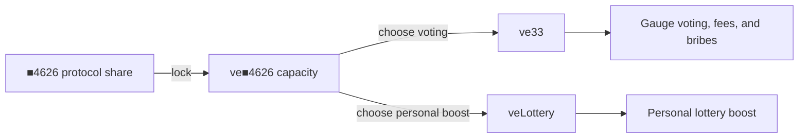

# ve■4626, ve33, and veLottery

Lock **■4626** to create decaying **ve■4626** power. You can assign that power to **ve33** for voting or opt into **veLottery** for a personal lottery boost.

**Short version:** lock ■4626 → choose a utility → keep it within your decaying capacity. The lock asset and the creator shares that cover a trade are different tokens.

## Follow the journey

1. **Acquire ■4626.** This is the protocol ShareOFT, not a creator’s `■TICKER`.
2. **Lock ■4626.** The lock creates ve■4626 capacity that decays toward the lock’s end.
3. **Choose how to use the capacity.**
   - Claim **ve33** for gauge voting, fees, and bribes.
   - Claim **veLottery** to opt into the personal lottery multiplier.
   - Split capacity between both lanes if desired.
4. **Keep utilities synchronized.** As the lock decays, excess utility is removed so ve33 plus veLottery never exceeds the remaining capacity.

## The names

| Name | What it means | What it does not mean |
|------|---------------|-----------------------|
| **ve■4626** | Decaying power created by locking ■4626 | A transferable token |
| **ve33** | Voting utility assigned from ve■4626 | Personal lottery odds |
| **veLottery** | Opt-in personal lottery utility | The vault-wide gauge vote |

**veLottery** is the canonical name. Older `veChance` and `veVote` names are retired.

## Two balances are involved

The personal boost needs both veLottery power and creator-share coverage:

| Balance | Role |
|---------|------|
| Locked **■4626** → veLottery | Determines your share of total live ve power |
| The traded creator’s **■TICKER** | Covers the portion of this trade eligible for the uplift |

Holding a creator’s `■TICKER` does **not** create ve■4626. Locking ■4626 does **not** by itself provide creator-share coverage for every trade.

## How the personal boost works

The raw multiplier is Curve-style and stays between **1.0× and 2.5×**. The trade receives only the covered portion of the uplift:

| Situation | Effective result |
|-----------|------------------|
| No eligible veLottery or no creator-share coverage | **1.0×** |
| Full ve match and 50% creator-share coverage | **1.75×** |
| Full ve match and full creator-share coverage | **2.5×** |

The 50% example starts with the 1.5× uplift between 1.0× and 2.5×, then applies half of it: `1.0 + 50% × 1.5 = 1.75×`.

[Read the machine-checked formula and proof](/audits/aristotle/curve-boost).

## Why power changes over time

ve■4626 decays as the lock approaches expiry. Raw utility balances can briefly show the previously claimed amount, so consumers use decay-safe effective balances. Synchronization removes excess **veLottery first**, then ve33 if more capacity must be reclaimed.

Extending or increasing a lock can restore capacity. It does not silently choose a utility on your behalf.

## Keep the two lottery layers separate

- **veLottery** controls a user’s personal multiplier.
- **ve33 gauge voting** directs a separate vault-level probability budget.
- The final win chance is still subject to the LotteryManager hard cap.

## Read next

- [Curve 2.5× boost proof](/audits/aristotle/curve-boost)
- [How fees and the lottery work](/overview/how-it-works)
- [LotteryManager4626](/contracts/utilities/lottery-manager)
- [Glossary](/reference/glossary)
