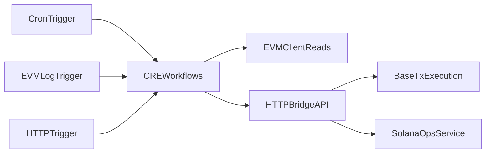

# CRE Phase 0 Audit and Target Architecture

## Scope

Audit target: `cre/cre-workflows` as the CRE SDK layer that should become the primary orchestration path for 4626.

## Current State

### A) CRE workflow inventory

| Workflow | Trigger | Schedule | Chains | Onchain reads | Writes | External calls |
|---|---|---|---|---|---|---|
| `keepr-queue` | Cron | `*/30 * * * * *` | N/A (HTTP-only) | None | Indirect via queue executor | `/keepr/actions/pending`, `/keepr/actions/updateStatus`, `/keepr/actions/execute` |
| `vault-keeper` | Cron | `0 */5 * * * *` | Base (`ethereum-mainnet-base-1`) | Vault state fields (`coinBalance`, `minimumTotalIdle`, `lastReport`, etc.) | HTTP bridge to onchain | `/cre/vaults/active`, `/cre/keeper/tend`, `/cre/keeper/report` |
| `auction-settlement` | Cron | `0 0 * * * *` | Base (`ethereum-mainnet-base-1`) | `currentAuction`, `isGraduated`, `sweepCurrencyBlock` | HTTP bridge to onchain + DB mark | `/cre/vaults/active?settled=false`, `/cre/keeper/sweep`, `/cre/keeper/mark-settled` |
| `payout-integrity` | Cron | `0 */30 * * * *` | Base (`ethereum-mainnet-base-1`) | Creator coin, gauge, burn stream, balance checks | No direct onchain writes | `/cre/vaults/active`, `/cre/keeper/alert`, `/cre/keeper/aiAssess` |

### B) Structure and correctness findings

1. **Local simulation miswire**
   - `auction-settlement/workflow.yaml` maps `local-simulation` to `config.staging.json`.
   - No `config.local-simulation.json` exists for settlement workflow.

2. **Config/runtime chain drift**
   - `chainName` exists in workflow configs, but `main.ts` implementations hardcode Base selector and hardcode `chainId=8453` in API queries.
   - This reduces portability and makes config values misleading.

3. **Secrets source-of-truth drift risk**
   - Shared `cre/cre-workflows/secrets.yaml` is referenced by all workflow YAML files.
   - Per-workflow duplicate `secrets.yaml` files still exist and can drift.

4. **Dependency/runtime drift risk**
   - Per-workflow package files duplicate setup with ranged deps (`^`) and `@types/bun: latest`.

5. **Generated file hygiene**
   - Temporary `.cre_build_tmp.js` artifacts appear in git status and are not ignored by `cre/cre-workflows/.gitignore`.

6. **CI coverage gap**
   - `.github/workflows/test.yml` does not run CRE SDK compile/simulate/validation steps.

### C) Gap analysis vs CRE-first orchestration

1. **Two active orchestration layers**
   - CRE SDK workflows in `cre/cre-workflows`.
   - Legacy runner/actions in `cre/runner.ts`, `cre/workflows`, `cre/actions`.

2. **Legacy-only capability set**
   - Ajna bucket manager.
   - Charm rebalance manager.
   - Strategy WebSocket listener.
   - Solana relays/monitors (entry, fee flush, winner relay, graduation, price monitor).

3. **Trigger model underused**
   - Production CRE workflows are cron-only today.
   - No EVM log-triggered production workflow for event-driven strategy enqueuing.
   - No CRE HTTP-triggered production workflow for operator/manual recovery paths.

4. **Coverage bottlenecks**
   - Some workflows process only the first eligible vault (`find(...)` or `vaults[0]`), causing starvation when the vault set grows.

5. **Repeated cross-file scaffolding**
   - Repeated HTTP auth/body encoding and EVM read helper logic across all four CRE workflow files.

## Target Architecture (Priority Ordered)

### Priority 0: Stabilize current CRE workflows

- Fix settlement local simulation wiring and add local config.
- Centralize shared helpers under `cre/cre-workflows/_shared`.
- Make chain selector and chainId config-driven.
- Add deterministic rotating selection/pagination so all eligible vaults are eventually handled.
- Normalize secrets source-of-truth and ignore generated temp files.

### Priority 1: Migrate Ajna + Charm into CRE SDK workflows

- Add CRE workflows for Ajna and Charm logic now in legacy actions.
- Preserve deterministic controls (thresholds, cooldown checks, ownership checks, dedupe semantics).
- Use cron heartbeat plus optional manual HTTP trigger for recovery.

### Priority 2: Replace strategy WebSocket daemon with CRE event triggers

- Introduce an EVM log-triggered CRE workflow for `Swap` events.
- Add cron backfill/reconciliation companion for missed event recovery.
- Move listener checkpointing from local file state to durable backend state.

### Priority 3: Fold Solana operations into CRE orchestration boundary

- Keep Solana execution off-chain, but orchestrate through CRE workflows.
- Use HTTP-triggered workflows for event/manual kicks plus cron reconciliation workflows.
- Add idempotent checkpoints so retries are safe.

### Priority 4: Native CRE write-path spike

- Prototype receiver-contract flow for `runtime.report()` + `writeReport()` for tend/report/sweep.
- Keep existing HTTP bridge as fallback until native path is validated.

### Priority 5: CI/CD and operational hardening

- Add a CRE-focused GitHub Actions pipeline for typecheck/test/simulation/config validation.
- Add secret scanning for CRE paths.
- Add run-level observability standards (correlation IDs, persistent alerts, SLO reporting).

## Target Flow

