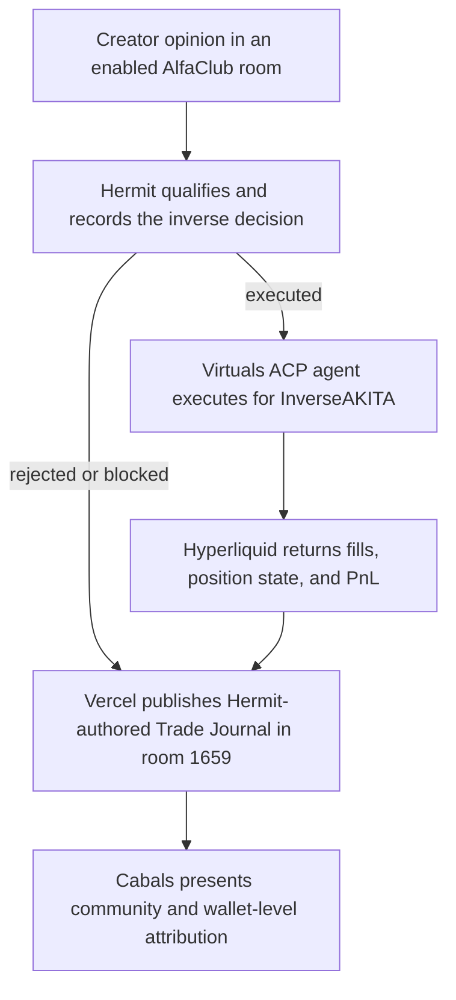
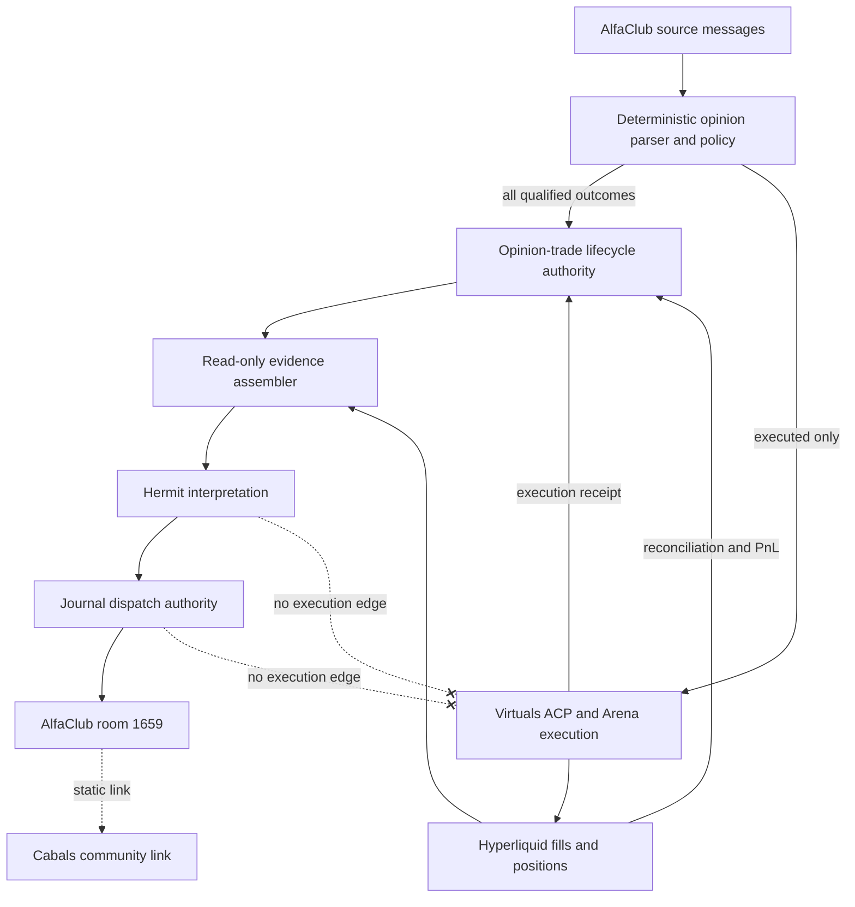
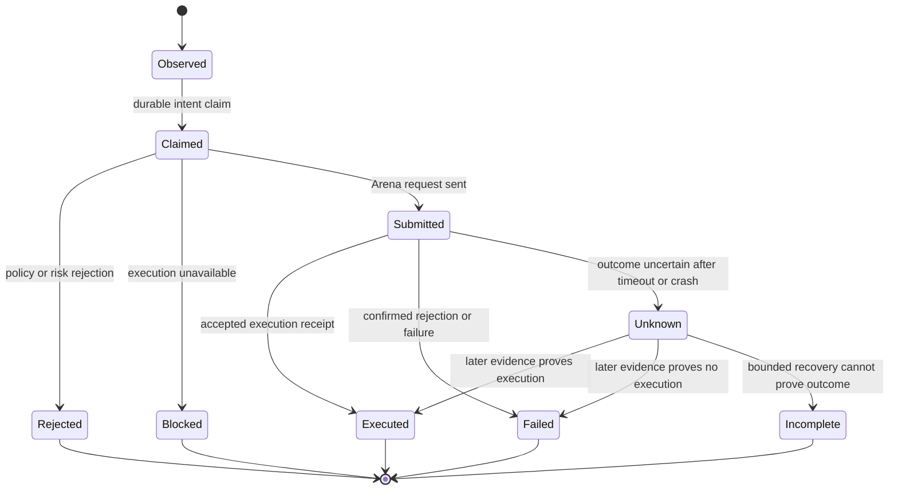
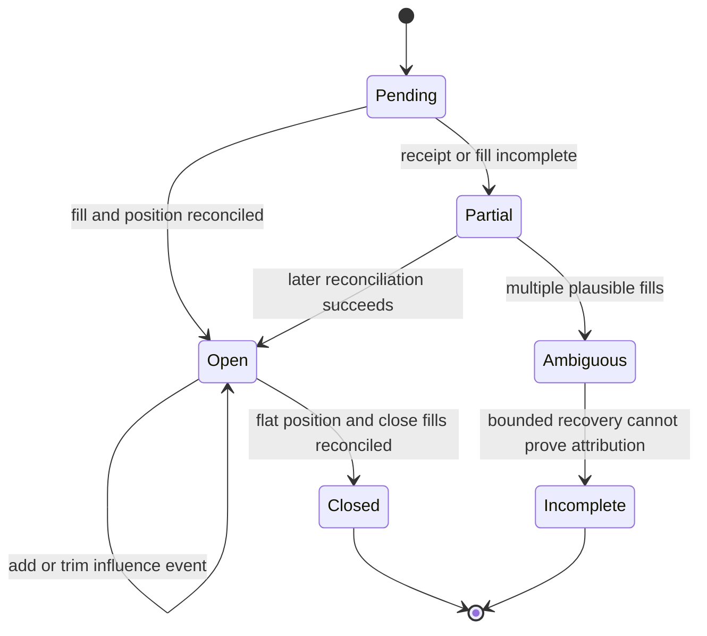
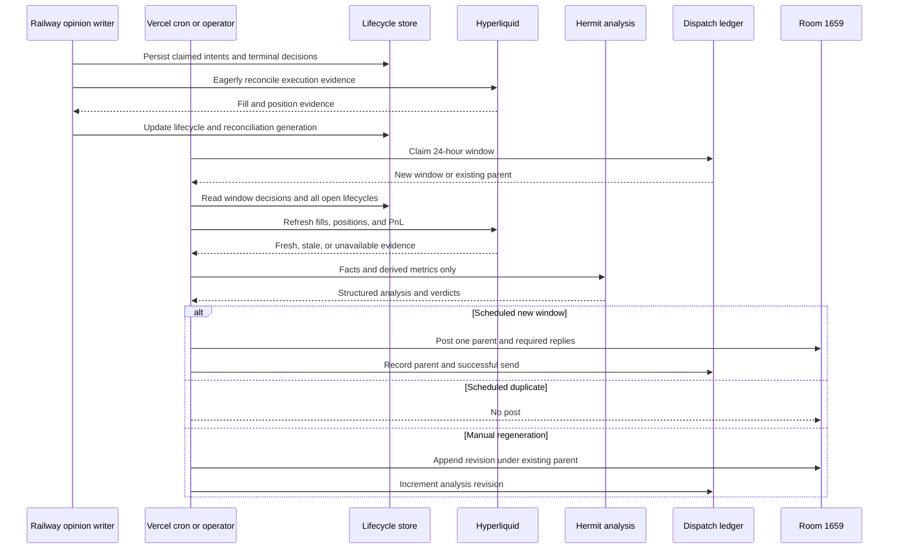

# InverseAKITA Trade Journal - Plan

## Goal Capsule

- **Objective:** Replace the generic AlfaClub daily brief with a truthful daily journal of trades generated from qualified creator market opinions.
- **Product authority:** AlfaClub room `1659` is the single InverseAKITA journal, operator, and strategy room.
- **Execution profile:** Establish durable attribution first, then reconciliation, analysis, and room delivery; preserve Railway Hermit as the only trade executor.
- **Stop conditions:** Do not launch if attribution can be invented, journal verdicts can reach execution, retries can duplicate parent posts, or scheduled output can reach rooms other than `1659`.
- **Tail ownership:** Railway Hermit owns opinion capture and execution-side writes. Vercel reads trade evidence without mutating trade state while owning journal analysis, dispatch-ledger writes, publication, and monitoring.

---

## Product Contract

### Summary

The daily InverseAKITA Trade Journal will explain the complete lifecycle of creator-opinion trades in room `1659`: source opinion, inverse thesis, Hermit analysis, Virtuals ACP execution, Hyperliquid performance, and Cabals community attribution.

### Problem Frame

The current daily brief describes broad market conditions, creator rankings, and room economics, but it does not explain the trades InverseAKITA generated from creators' market opinions.

Readers see several working parts—AlfaClub rooms, Hermit4626, InverseAKITA, Virtuals ACP, Hyperliquid, and Cabals—without a single factual narrative connecting them. Existing execution paths can react to an opinion, but existing durable records cannot always prove which opinion produced a specific execution or measure that opinion's complete outcome.

### Key Decisions

- **One journal room:** Room `1659` is the only scheduled destination, preventing repeated unsolicited posts across watcher rooms.
- **Opinion trades only:** Generic market rankings, movers, and unrelated commentary do not appear unless they directly explain an attributed trade decision.
- **Lifecycle reporting:** A position remains in the journal until it closes, even when it originated before the current reporting window.
- **Transparent restraint:** Qualified opinions that produced no trade are summarized with concrete rejection reasons.
- **Analysis does not execute:** Daily `hold`, `add`, `trim`, `exit`, and `watch` verdicts inform operators but never mutate positions.
- **Honest Cabals framing:** The journal links InverseAKITA on Cabals as a community and wallet-level attribution surface without claiming Cabals stores the source-opinion lineage.
- **Privacy-safe cross-room attribution:** Show a qualified author's public handle or shortened wallet, a paraphrased opinion, and the source room; never republish raw quotes or direct message links in room `1659`.

### Actors

- A1. **Creator or qualified room participant:** Publishes a market opinion in an enabled AlfaClub room.
- A2. **Hermit4626:** Interprets the opinion, explains the inverse thesis, and authors the daily journal analysis.
- A3. **InverseAKITA:** Owns the counter-position strategy and its tracked trade lifecycle.
- A4. **Virtuals ACP agent:** Executes approved InverseAKITA trades through the configured agent identity.
- A5. **Hyperliquid:** Supplies execution, fill, position, market, and PnL truth.
- A6. **Cabals:** Presents the InverseAKITA community and wallet-level attribution context.
- A7. **Room `1659` readers and operators:** Review decisions, performance, risks, and system behavior.

### Requirements

**Attribution and lifecycle truth**

- R1. Every journaled trade must retain its originating AlfaClub room, internal source-message identity, privacy-safe public author attribution, opinion side, inferred market, and source timestamp.
- R2. Every qualified opinion must produce a durable decision outcome of executed, rejected, blocked, or failed.
- R3. An executed decision must link the source opinion to the inverse side, requested parameters, ACP execution result, Hyperliquid fills, and resulting position.
- R4. A journaled position must remain trackable across daily boundaries until fully closed.
- R5. Closed positions must retain realized outcome and enough history to explain how the thesis evolved.
- R6. Missing attribution or execution evidence must appear as unknown or incomplete rather than being inferred as fact.

**Daily journal content**

- R7. The scheduled journal must post only in AlfaClub room `1659`.
- R8. The journal must summarize the reporting window with counts for qualified opinions, executed trades, rejected or blocked opinions, failed executions, open positions, and closed positions.
- R9. Each executed trade must identify the qualified creator owner or authorized room-`1659` staker whose opinion triggered it, paraphrase what they expressed, and explain what inverse position InverseAKITA took and why.
- R10. Each open trade must show entry context, current position state, unrealized PnL, thesis status, and an analysis-only verdict of `hold`, `add`, `trim`, `exit`, or `watch`.
- R11. Each closed trade must show realized PnL and a concise assessment of whether the inverse thesis was correct, early, late, or invalidated.
- R12. Rejected or blocked qualified opinions must be summarized briefly with concrete risk or policy reasons and without reproducing unrelated chat.
- R13. When no qualified opinions or tracked positions exist, the journal must publish a concise no-activity statement without generic filler.

**Analysis quality**

- R14. Trade analysis must distinguish observed facts, derived metrics, and Hermit's interpretation.
- R15. Analysis must use relevant implemented evidence such as market regime, funding and open interest, liquidity, execution quality, position exposure, FriendKey authority, and prior thesis changes.
- R16. Evidence must be trade-specific; unrelated market data must not be included merely to make the journal longer.
- R17. Every action verdict must include confidence, supporting evidence, invalidation conditions, and the next condition to watch.
- R18. Journal verdicts must never call execution or position-adjustment paths.

**System explanation and attribution surfaces**

- R19. The journal must explain the working chain from creator opinion through Hermit4626, InverseAKITA, Virtuals ACP, and Hyperliquid in language suitable for readers unfamiliar with the architecture.
- R20. The journal must identify and link the originating AlfaClub room, the Virtuals agent surface, and `https://cabals.com/cabal/inverseakita` where appropriate; it must not expose a direct source-message link.
- R21. Cabals must be described as InverseAKITA's community and wallet-level attribution surface, not as the source of internal opinion-to-trade lineage.
- R22. The journal must identify Hyperliquid as execution and PnL truth while preserving AlfaClub as opinion and room-context truth.

**Delivery and noise control**

- R23. The journal must be one scheduled parent post with structured replies or sections only when trades require additional detail.
- R24. The scheduled journal must be idempotent for a reporting window.
- R25. Manual regeneration may update analysis but must not duplicate the same journal in room `1659`.
- R26. Existing real-time inverse reactions and command replies remain separate from the daily journal.

### Attribution Flow

The internal attribution chain remains authoritative for source opinions and decisions. Cabals complements that chain but does not replace it.

### Key Flows

- F1. **Qualified opinion executes**
  - **Trigger:** A qualified creator or participant publishes an actionable market opinion in an enabled room.
  - **Actors:** A1, A2, A3, A4, A5
  - **Steps:** Hermit records the source opinion, derives the inverse decision, records the ACP attempt, links resulting fills, and opens or updates the tracked lifecycle.
  - **Outcome:** The next journal can explain who influenced the trade, what InverseAKITA did, and how it is performing.
  - **Covered by:** R1-R6, R9-R11, R14-R18

- F2. **Qualified opinion is declined**
  - **Trigger:** An actionable opinion fails a risk, authority, market-support, cooldown, or execution-readiness check.
  - **Actors:** A1, A2, A3
  - **Steps:** Hermit records the opinion and specific decision reason without creating a trade.
  - **Outcome:** The journal includes the decline in its transparent restraint summary.
  - **Covered by:** R2, R6, R8, R12

- F3. **Daily journal publishes**
  - **Trigger:** The daily room `1659` schedule runs.
  - **Actors:** A2, A5, A6, A7
  - **Steps:** Vercel gathers the reporting-window decisions, all still-open attributed positions, newly closed outcomes, and current evidence; Hermit supplies structured interpretation; Vercel publishes one idempotent journal.
  - **Outcome:** Readers understand what InverseAKITA traded, whose opinions drove it, why it acted, current performance, and how the external surfaces relate.
  - **Covered by:** R7-R25

- F4. **Open thesis is reviewed**
  - **Trigger:** A previously attributed trade remains open at journal time.
  - **Actors:** A2, A3, A5, A7
  - **Steps:** Hermit compares current evidence with the original and prior thesis, assigns an analysis-only action verdict, and names invalidation and watch conditions.
  - **Outcome:** The journal carries the position forward without adjusting it.
  - **Covered by:** R4, R10, R14-R18

### Acceptance Examples

- AE1. **Covers R1-R4, R9, R20.** Given a qualified creator posts a bullish BTC opinion in room `1484`, when InverseAKITA opens the inverse short through Virtuals ACP, then the room `1659` journal attributes the short to that creator and source message and links the resulting execution lifecycle.
- AE2. **Covers R2, R8, R12.** Given five qualified opinions and two are rejected by risk controls, when the journal publishes, then it reports three executed and two rejected with concise reasons.
- AE3. **Covers R4, R10, R17-R18.** Given an attributed position remains open for three days, when each daily journal publishes, then the position remains visible with updated PnL and evidence-based analysis while no journal verdict triggers execution.
- AE4. **Covers R5, R11.** Given an attributed position closes during the reporting window, when the journal publishes, then it reports realized PnL and assesses the original inverse thesis.
- AE5. **Covers R6, R14.** Given a fill cannot be reliably joined to a source opinion, when the journal renders it, then the attribution is marked incomplete and Hermit does not invent the creator or rationale.
- AE6. **Covers R7, R23-R25.** Given the scheduled job retries, when the same reporting window has already posted, then no duplicate appears in room `1659` or any other watcher room.
- AE7. **Covers R13.** Given no qualified opinions and no tracked positions, when the schedule runs, then room `1659` receives only a concise no-activity journal.
- AE8. **Covers R19-R22.** Given a new reader opens the journal, when they follow its explanation and links, then they can distinguish AlfaClub opinion truth, Hermit analysis, InverseAKITA strategy, Virtuals ACP execution, Hyperliquid performance truth, and Cabals community attribution.

### Success Criteria

- Every executed opinion-driven trade in the journal has a verifiable source opinion and execution lifecycle, or is explicitly marked incomplete.
- Room `1659` is the only scheduled AlfaClub destination.
- Readers can identify who influenced each trade, what inverse action occurred, why it occurred, and its current or realized outcome.
- Open positions persist across journals until closure.
- Rejected qualified opinions are visible without overwhelming the executed-trade narrative.
- No daily analysis verdict changes a position.
- Cabals, Virtuals ACP, Hyperliquid, Hermit4626, InverseAKITA, and AlfaClub are described with accurate and distinct roles.

### Scope Boundaries

- The journal does not include generic creator leaderboards, broad market movers, or unrelated room commentary.
- The journal does not post scheduled copies in rooms `2`, `1043`, `1484`, or `1660`.
- The journal does not change the real-time inverse reaction policy or its creator and staker authority gates.
- The journal does not execute `add`, `trim`, `exit`, or other trade operations.
- The product does not automate Cabals or call undocumented Cabals APIs.
- The product does not claim Cabals stores creator-message attribution that remains internal to 4626.
- The journal does not reproduce exact source-message text or direct message links across rooms.

### Dependencies and Assumptions

- AlfaClub remains the authority for source messages, room identity, and creator-opinion context.
- The InverseAKITA execution identity remains the shared Virtuals ACP agent and Hyperliquid wallet configured for this strategy.
- Hyperliquid remains the authority for fills, position state, and PnL.
- Creator display attribution may vary by room, but the journal always retains a stable source identifier.
- Existing market, FriendKey, room, and position intelligence can support analysis once joined to the attributed trade lifecycle.
- Cabals continues to expose the InverseAKITA community page and wallet-level attribution without a supported automation API.

### Sources and Research

- `frontend/server/_lib/alfaclub/dailyBrief.ts` — current daily brief behavior and room delivery.
- `frontend/server/_lib/alfaclub/inverseAkitaChatReaction.ts` — opinion parsing and inverse execution behavior.
- `frontend/server/_lib/alfaclub/inverseAkitaChatReactionPolicy.ts` — creator and staker authority rules.
- `frontend/server/_lib/arena/arenaClient.ts` — Virtuals ACP and trade execution surface.
- `docs/_internal/operations/alfaclub/virtuals-arena-railway-runbook.md` — production agent and room operating model.
- `docs/_internal/operations/alfaclub/cabals-onboarding.md` — Cabals identity, attribution, and automation constraints.

---

## Planning Contract

### Product Contract Preservation

Product Contract unchanged. Planning adds implementation boundaries and verification without changing R1-R26, A1-A7, F1-F4, or AE1-AE8.

### Key Technical Decisions

- **KTD1 — Dedicated live attribution authority:** Add a sibling opinion-trade lifecycle store for creator-message lineage. The shadow `decision_ledger`, fill-driven `counter_trade_*` ledgers, and `command_reply_ledger` retain their existing meanings and are not journal authorities.
- **KTD2 — Write facts at reaction time:** Persist source-message snapshots and every executed, rejected, blocked, or failed decision while the live reaction context exists. Journal-time reconstruction is a fallback for market state, never a substitute for source lineage.
- **KTD3 — Separate messages, intents, and position lifecycle:** Store one source message with one or more deterministic normalized opinion intents. Each intent gets its own decision; executed decisions attach to a shared position lifecycle keyed by executor wallet, normalized market, and side.
- **KTD4 — Hyperliquid remains performance truth:** Reconcile fills, open state, unrealized PnL, closure, and realized PnL from Hyperliquid. Ambiguous or delayed matches stay partial or unknown rather than being assigned by timing alone.
- **KTD5 — Structured evidence before prose:** Build a typed journal bundle with observed facts, derived metrics, provenance, freshness, and missing fields before requesting Hermit interpretation. The model may explain and classify but may not generate measurements.
- **KTD6 — Analysis-only module boundary:** Journal analysis and publication cannot import or call Arena trade execution, inverse reaction execution, counter-trade entry, or position mutation paths. Unsupported model output falls back to a low-confidence `watch` verdict.
- **KTD7 — Independent journal dispatch:** Use a dedicated 24-hour reporting-window dispatch ledger and stable client message IDs. Scheduled retries skip existing windows; manual regeneration appends a revision beneath the existing parent.
- **KTD8 — Hard-pinned destination and cutover:** The journal publisher targets room `1659` directly rather than inheriting command-room lists. Launch disables the generic room-`1659` daily brief so the two scheduled products cannot overlap.
- **KTD9 — Current and future attribution only:** Capture begins when the lifecycle writer ships. Historical trades without provable source lineage are not backfilled as attributed facts.
- **KTD10 — Static external attribution links:** Virtuals agent and Cabals links are explanatory references only. No Cabals credentials, private API calls, scraping, or automation enter the runtime.
- **KTD11 — Independent capture and publication gates:** Railway opinion capture remains enabled through publisher rollback; Vercel journal publication is the independent cutover switch.
- **KTD12 — Fail-closed live attribution:** A qualified opinion cannot reach Arena until its durable claimed intent exists. Reply dedupe remains separate and cannot authorize unattributed execution.
- **KTD13 — Claim-before-send publication:** The dispatch authority atomically claims a room/window before sending. Only the winning claimant may create the parent; send failure remains recoverable without treating the window as complete.
- **KTD14 — Position-level accounting:** Hyperliquid PnL belongs to the shared market/side position lifecycle. Individual opinions retain their own execution evidence and influence events but do not receive allocated realized PnL unless future lot-level accounting can prove it.
- **KTD15 — Conservative unknown-outcome recovery:** Execution and publication attempts carry durable claimant identity and state. A timeout after a potentially accepted external side effect is never blindly retried; reconciliation or operator review resolves the unknown state.
- **KTD16 — Strong manual-publication authorization:** Scheduled dispatch uses cron machine authentication; manual regeneration additionally requires an authenticated admin, machine proof, bounded window input, explicit confirmation, and an audit record.
- **KTD17 — Privacy-safe disclosure projection:** Internal source identifiers and hashes remain available for audit, while room `1659` receives only public handle or shortened wallet, paraphrased opinion, and source-room context for qualified creator owners and authorized room-`1659` stakers.

### High-Level Technical Design

#### Component and authority topology

Railway Hermit owns the mutable path from source opinion through ACP execution receipt. Vercel reads the resulting lifecycle and external market truth to compose and post the journal; it does not gain trade authority.

#### Decision lifecycle

The execution phase is distinct from terminal decision outcome. A source message may yield multiple normalized intents, and each claimed intent resolves independently.

#### Reconciliation and position lifecycle

Executed decisions may create or update a shared position lifecycle that survives reporting-window boundaries. Journal PnL is reported at that lifecycle level, while each influencing opinion remains independently visible.

#### Scheduled and manual publication sequence

Failed sends do not complete the dispatch claim. Hyperliquid delay does not suppress the journal; affected measurements carry freshness and incompleteness markers.

### Data and State Boundaries

- **Source message:** Stable source-room and message identity, source hash, bounded excerpt, sender attribution, and source timestamp.
- **Opinion intent and decision:** Deterministic intent identity, parsed clause/market/side, inverse intent, access decision, execution phase, nullable terminal outcome, reason, executor identity, requested parameters, receipt summary, and attribution quality.
- **Decision versus reconciliation state:** Execution phase records observed, claimed, submitted, resolved, or unknown; terminal outcome records executed, rejected, blocked, failed, or incomplete; reconciliation independently records pending, partial, open, closed, ambiguous, or incomplete evidence.
- **Position lifecycle:** Executor wallet, normalized market and side, opening decision, linked add/trim decisions, fill evidence, open/closed state, entry and close context, current PnL snapshot, realized result, monotonic reconciliation generation, and last successful reconciliation time.
- **Journal analysis:** Reporting window, lifecycle reference, observed facts, derived metrics, interpretation, verdict, confidence, invalidation condition, next watch condition, model/version provenance, and `analysis_only` classification.
- **Journal dispatch:** Window boundaries, fixed room `1659`, claim/send state, parent message identity, content hash, analysis revision, successful send time, and last regeneration time.
- **Integrity constraints:** Source room plus message is unique; execution attempts are unique; only one open lifecycle may exist per executor wallet, normalized market, and side; lifecycle events and analyses cannot outlive their referenced decision or lifecycle.
- **Provenance rule:** Source snapshots preserve what the system observed at decision time. Later label or message lookups may enrich display but may not rewrite source identity.
- **Source-text policy:** Persist only a bounded journal-safe excerpt and source hash in the new authority. Existing chat storage remains the full-text authority; health, analysis prompts, and smoke surfaces never receive raw source text.

### Failure and Recovery Policy

- ACP/Arena failure persists as `failed`; it is not omitted from the rejection summary.
- Attribution-store unavailability blocks execution for the affected qualified opinion; fail-open reply dedupe does not override this financial audit boundary.
- Policy, authority, cooldown, and risk decisions persist with stable reason codes.
- Unparseable receipts or multiple plausible fills produce partial attribution and no invented PnL.
- Hyperliquid failure preserves the last successful state with a visible `data_as_of` marker.
- Malformed Hermit output falls back to `watch`, low confidence, and a machine-readable analysis failure reason.
- Duplicate source messages and concurrent bridge ticks are no-ops after the durable decision claim; exactly one claimant may execute.
- A crash or timeout after Arena submission produces `unknown`; retries reconcile existing evidence and never resubmit blindly. If a downstream idempotency key becomes available, it must derive from the durable intent identity.
- Dispatch overlap is resolved by an atomic claim before send. A failed send retains recoverable state and never marks the window successful.
- Dispatch transitions through claimed, sending, sent, failed, or send-unknown with claimant token, lease, attempt count, and stable client message identity. Send-unknown requires message lookup or operator resolution before another parent attempt.
- Journal outbound text is registered as bot-authored so bullish/bearish prose cannot trigger a new inverse reaction.
- Journal parent and reply text also carry a durable bot-authored marker so suppression survives process restarts and the in-memory TTL.
- Manual regeneration never re-executes a trade, never changes a lifecycle fact, and never creates a second parent.

### Sequencing

1. Establish schema, lifecycle state vocabulary, idempotent store operations, and architecture-guard scaffolding.
2. Enable fail-closed Railway opinion capture so every qualified outcome is durable.
3. Reconcile executed decisions eagerly after execution and periodically until complete.
4. Run capture and reconciliation in shadow mode for one full reporting window with publication disabled.
5. Build typed evidence and Hermit analysis behind a read-only boundary.
6. Enable room-`1659` publication only after ownership, attribution, and mutual-exclusion gates pass.
7. Add operational documentation, thresholded monitoring, rollback, and end-to-end smoke evidence.

### Risks and Dependencies

- **Shared-wallet ambiguity:** Multiple opinions can target the same market close together. Mitigate with execution-attempt identity, receipt evidence, conservative fill matching, and partial attribution when uniqueness cannot be proven.
- **Cross-host ordering:** Railway writes and Vercel reads may race. Persist decisions before execution where possible, expose incomplete state, and make reconciliation repeatable.
- **Schema deployment:** Runtime bootstrap and Supabase migration history must agree. Use the migration ledger and keep raw DDL out of production server modules.
- **LLM trust:** Action words overlap with live execution vocabulary. Enforce module isolation, structured output validation, called-not-called tests, and an architecture boundary test.
- **Duplicate publication:** Cron retry and manual regeneration have different semantics. Keep one parent per window and track analysis revisions separately.
- **Feedback loops:** Journal prose contains market sentiment. Register every outbound journal message through existing self-authored-text suppression.
- **Source-message privacy:** Duplicating raw chat text increases retention and operator exposure. Store a bounded excerpt/hash for journal use, retain full text only when required, and keep ops outputs count-only.
- **External attribution drift:** Cabals and Virtuals surfaces may change independently. Keep links configurable or centralized and avoid external automation assumptions.

### Documentation and Operational Notes

- Update `docs/_internal/operations/alfaclub/virtuals-arena-railway-runbook.md` with lifecycle ownership, journal health checks, cutover, and rollback.
- Update `docs/_internal/operations/alfaclub/cabals-onboarding.md` only to link the journal and restate the static-attribution boundary.
- Document the journal schedule, reporting window, room pin, enabled flag, manual regeneration behavior, and generic-brief disablement in `frontend/.env.example`.
- Expose redacted health counts for decisions awaiting reconciliation, incomplete attribution, last successful journal, and latest analysis failure.
- Document an ownership matrix: Railway must own lifecycle writes and trade execution; Vercel must own journal composition and cron dispatch; either host advertising the opposite role is a launch failure.
- Rollback disables journal publication and restores the prior brief without disabling capture or deleting lifecycle records.

---

## Implementation Units

### U1. Add the opinion-trade lifecycle authority

**Goal:** Create the durable source of truth for source messages, normalized opinion intents, decision outcomes, and executed position lifecycles.

**Requirements:** R1-R6, R14, R24-R25; F1-F4; AE5-AE6

**Dependencies:** None

**Files:**

- Create `supabase/migrations/20260717000000_alfaclub_inverse_opinion_trade_lifecycle.sql`
- Modify `frontend/server/_lib/db/schemaBootstrap.ts`
- Create `frontend/server/_lib/alfaclub/inverseOpinionTradeStore.ts`
- Create `frontend/server/_lib/alfaclub/inverseOpinionTradeStore.test.ts`
- Modify `frontend/scripts/guard-no-raw-schema-ddl.mjs` only if the migration naming requires guard coverage

**Approach:**

- Add private AlfaClub tables for source messages, normalized opinion intents/decisions, position lifecycles, and lifecycle events.
- Use source room plus source message as the message idempotency boundary and message identity plus deterministic intent ordinal/market as the decision boundary.
- Separate terminal decision outcome from reconciliation/lifecycle state and enforce both vocabularies with database constraints.
- Use executor wallet, normalized market, and side as the position identity; preserve each influencing decision as a separate event.
- Enforce one open lifecycle per executor wallet, normalized market, and side; preserve dependent intent and lifecycle events with restrictive foreign keys.
- Bound source excerpts, store no duplicated full text, and keep all tables service-role-only with RLS deny-all.
- Enforce outcome, lifecycle, attribution-quality, evidence-layer, and verdict vocabularies at the storage boundary.
- Add a dedicated schema-bootstrap helper with table-existence probes so Railway cold starts apply or verify the new migration before recording it as applied.
- Follow existing migration bootstrap and redacted error conventions.

**Patterns to follow:**

- `frontend/server/_lib/alfaclub/commandReplyLedger.ts`
- `frontend/server/_lib/alfaclub/decisions/decisionLedgerStore.ts`
- `frontend/server/_lib/alfaclub/counterTradeStore.ts`
- `supabase/migrations/20260610000000_alfaclub_daily_brief_dispatch.sql`

**Test scenarios:**

- Duplicate insert for the same source room and message returns the same decision rather than creating another row.
- Execution phase and terminal outcome enforce separate vocabularies and legal transitions.
- An executed decision can open a lifecycle and a later decision can append add/trim influence without replacing the opening decision.
- A second open lifecycle for the same executor wallet, market, and side is rejected by the database.
- Invalid outcome, lifecycle, attribution-quality, evidence-layer, and verdict values are rejected by the database.
- Attempted-to-executed progression updates the same source decision rather than inserting another row.
- One source message with BTC and ETH clauses persists two deterministic intent decisions without weakening message-level dedupe.
- A lifecycle remains queryable when its source decision falls outside the current reporting window.
- Dispatch claim for the same room and window is idempotent; manual revision increments analysis revision without creating another parent identity.
- Database errors return redacted diagnostics and never include source text or credentials.
- Schema bootstrap runs before writes and recognizes an already-applied multi-table migration without replaying DDL.

**Verification:** Migration applies through the established bootstrap path, store tests prove state transitions and idempotency, and the schema guard remains clean.

### U2. Persist every live opinion decision at the reaction boundary

**Goal:** Capture complete source context and a durable outcome for every qualified opinion without changing real-time execution policy.

**Requirements:** R1-R3, R6, R12, R26; F1-F2; AE1-AE2

**Dependencies:** U1

**Files:**

- Modify `frontend/server/_lib/alfaclub/inverseAkitaChatReaction.ts`
- Create `frontend/server/_lib/alfaclub/inverseOpinionTradeRecorder.ts`
- Create `frontend/server/_lib/alfaclub/inverseOpinionTradeRecorder.test.ts`
- Modify `frontend/server/_lib/alfaclub/chatBridge.ts`
- Modify `frontend/server/_lib/alfaclub/inverseAkitaChatReaction.test.ts`
- Modify `frontend/server/_lib/alfaclub/chatBridge.test.ts`

**Approach:**

- Snapshot the source hash, bounded excerpt, sender, room, display attribution, parsed side, inferred market, parse mode, and timestamp while the live intent exists.
- Persist only a bounded excerpt/hash for the source; keep raw source text outside model prompts and the new lifecycle authority.
- Atomically create a claimed intent before the existing reply claim and before any Arena call; attribution-store failure blocks execution for that opinion.
- Update the same decision to a terminal outcome so policy rejections, disabled execution, cooldowns, metadata failures, ACP failures, and successful execution are all represented.
- Isolate persistence mapping in a thin recorder called by the reaction path; keep bridge changes limited to claim ordering and outbound behavior.
- Record the resolved shared executor identity and requested trade parameters when execution enters submitted state.
- Attach the immediate Arena receipt and parsed fill evidence when available.
- After submission, never blindly retry an unresolved attempt. Reconcile a durable unknown outcome against fills/positions and leave it incomplete when proof remains unavailable.
- Preserve existing reply claiming, reactions, source-room replies, and execution behavior.

**Execution note:** Add characterization coverage for current skip and success branches before adding lifecycle writes; this path controls live financial execution.

**Patterns to follow:**

- `frontend/server/_lib/alfaclub/inverseAkitaChatReactionPolicy.ts`
- `frontend/server/_lib/alfaclub/commandReplyLedger.ts`
- `frontend/server/_lib/arena/arenaIdentityMappingStore.ts`
- `frontend/server/_lib/arena/arenaClient.ts`

**Test scenarios:**

- Covers F1 / AE1. A qualified bullish BTC opinion in room `1484` records the source and an inverse short execution against the shared room-`1659` identity.
- Covers F2 / AE2. Five qualified opinions with three executions and two risk rejections persist the exact outcome counts and reason codes.
- Insufficient stake, wrong creator authority, cooldown, disabled Arena, unsupported market, failed ACP request, and successful fill each write one terminal decision outcome.
- A missing `chat_ingest` row does not erase the intent snapshot captured at reaction time.
- A duplicate bridge poll does not repeat execution or create a second decision.
- Concurrent bridge ticks for one message produce one decision and one execution call.
- One multi-market message produces one execution decision per normalized intent while preserving one source-message claim.
- A simulated crash before submit is safely reclaimable; a simulated crash after possible submit becomes unknown and causes zero automatic resubmissions.
- Attribution-store unavailability produces a blocked/fail-closed result and zero Arena calls.
- Existing real-time reply and emoji behavior remains unchanged.

**Verification:** Targeted inverse reaction and bridge tests prove one durable outcome per qualified message while called/not-called assertions show execution routing is unchanged.

### U3. Reconcile executions into cross-day Hyperliquid position lifecycles

**Goal:** Connect executed opinion decisions to conservative fill evidence, current positions, closure, and PnL without inventing attribution.

**Requirements:** R3-R6, R10-R11, R22; F1, F3-F4; AE3-AE5

**Dependencies:** U1, U2

**Files:**

- Create `frontend/server/_lib/alfaclub/inverseOpinionTradeReconciler.ts`
- Create `frontend/server/_lib/alfaclub/inverseOpinionTradeReconciler.test.ts`
- Create `frontend/server/_lib/alfaclub/inverseOpinionTradeReconcilerTicker.ts`
- Create `frontend/server/_lib/alfaclub/inverseOpinionTradeReconcilerTicker.test.ts`
- Modify `frontend/server/agents/hermit/index.ts`
- Modify `frontend/server/_lib/alfaclub/hyperliquid.ts` only if an existing read primitive cannot expose required fill identity
- Reuse `frontend/server/_lib/alfaclub/room1659Market.ts`

**Approach:**

- Prefer immediate Arena receipt evidence, then reconcile against Hyperliquid fills and clearinghouse state.
- Run one eager reconciliation after successful Railway execution and repeat reconciliation periodically for pending/partial lifecycles; journal composition performs a final read-only refresh.
- Match by persisted executor wallet, market, side, execution attempt time, requested action, and size evidence.
- Assign at most one high-confidence decision-to-fill match; mark multiple plausible candidates ambiguous.
- Carry all open lifecycles into later journal windows and close them only when position/fill evidence proves closure.
- Preserve `data_as_of`, attribution quality, and reconciliation failures for honest journal rendering.
- Report realized and unrealized PnL at the shared lifecycle level; decision events expose influence and execution details without allocating lifecycle PnL among opinions.
- Start and stop the periodic reconciler with Railway Hermit and expose redacted ticker freshness in health state.

**Execution note:** Implement reconciliation test-first because false attribution would make the public journal materially misleading.

**Patterns to follow:**

- `frontend/server/_lib/alfaclub/hyperliquid.ts`
- `frontend/server/_lib/alfaclub/roomTimeline.ts`
- `frontend/server/_lib/alfaclub/counterTradeHarvest.ts`
- `frontend/server/_lib/arena/arenaClient.ts`

**Test scenarios:**

- Covers AE3. A position opened before the current 24-hour window remains in the open-position result with refreshed unrealized PnL.
- Covers AE4. A closing fill and flat position close the lifecycle once and retain realized PnL.
- Covers AE5. Two plausible fills for one decision yield ambiguous attribution and no invented creator-level PnL.
- Partial fill evidence records partial state and can become complete on a later reconciliation pass.
- Repeating reconciliation for the same fills is idempotent and never duplicates lifecycle events or downgrades confirmed attribution.
- Pre-cutover fills without a source decision remain unlinked and cannot become historical creator attribution.
- Hyperliquid timeout preserves prior state with a stale timestamp and does not zero PnL.
- Multiple opinions that add to or trim the same market/side position remain separate lifecycle events.
- Multiple influencing opinions share lifecycle PnL without receiving invented decision-level allocations.

**Verification:** Reconciler tests prove deterministic matching, cross-day carry, close settlement, stale-data behavior, and incomplete attribution.

### U4. Build structured journal evidence and analysis-only Hermit verdicts

**Goal:** Produce trade-scoped facts, derived metrics, and validated Hermit interpretation without granting analysis any execution capability.

**Requirements:** R8-R22; F3-F4; AE3-AE5, AE8

**Dependencies:** U1, U3

**Files:**

- Create `supabase/migrations/20260717010000_alfaclub_inverse_opinion_trade_analysis.sql`
- Create `frontend/server/_lib/alfaclub/inverseAkitaTradeJournalAnalysis.ts`
- Create `frontend/server/_lib/alfaclub/inverseAkitaTradeJournalAnalysis.test.ts`
- Create `frontend/server/_lib/alfaclub/inverseAkitaTradeJournalEvidence.ts`
- Create `frontend/server/_lib/alfaclub/inverseAkitaTradeJournalEvidence.test.ts`
- Create `frontend/server/_lib/alfaclub/inverseAkitaTradeJournal.architecture.test.ts`
- Reuse `frontend/server/_lib/alfaclub/regimes/fundingOiRegimeFine.ts`
- Reuse `frontend/server/_lib/alfaclub/room1659Market.ts`
- Reuse `frontend/server/_lib/alfaclub/creatorDisplayLabels.ts`
- Reuse `frontend/server/_lib/alfaclub/counterTradeLlmAdvisor.ts` structured prompt/parse/injection patterns

**Approach:**

- Build observed facts and deterministic metrics in a pure evidence module separate from LLM analysis and publication.
- Source FriendKey authority from the recorded room/owner access result and prior thesis changes from lifecycle analysis history; mark either unavailable when evidence does not exist.
- Label every evidence item as fact, derived metric, or interpretation and include provenance plus freshness.
- Exclude raw source text and display attribution from Hermit prompts; send deterministic parsed opinion fields and server-issued evidence identifiers, then render a privacy-safe paraphrase separately.
- Build the public attribution projection after analysis: prefer a public handle, fall back to a shortened wallet, paraphrase the normalized opinion, link only the source room, and omit exact quotes/message links.
- Ask Hermit through an injectable structured-analysis client for `hold`, `add`, `trim`, `exit`, or `watch` with confidence, evidence references, invalidation, and next watch condition.
- Validate model output; unsupported or malformed output becomes low-confidence `watch`.
- Persist analysis snapshots independently from lifecycle facts.
- Persist a separate closed-thesis assessment of `correct`, `early`, `late`, or `invalidated` for closed lifecycles.
- Do not call the creative `/api/hermit/draft` contract or import `skillRouter.ts`; both carry creative or transitive execution concerns.
- Add a static architecture test that forbids journal modules from importing execution and mutation entry points.

**Patterns to follow:**

- `frontend/server/_lib/alfaclub/counterTradeEntryAdvisory.ts`
- `frontend/server/_lib/alfaclub/counterTradeLlmAdvisor.ts`
- `frontend/server/_lib/hermit/architectureBoundary.test.ts`
- `frontend/server/_lib/alfaclub/decisions/counterDecisionEngine.ts`

**Test scenarios:**

- Covers AE3. An open position receives a valid action verdict with confidence, cited evidence, invalidation, and watch condition.
- Covers AE5. Missing or stale evidence remains marked incomplete and is not promoted to fact by Hermit output.
- Pure evidence assembly produces the same facts bundle without any LLM dependency.
- Evidence assembly includes FriendKey authority and prior thesis history when relevant or explicit unavailable markers when absent.
- Covers AE8. The analysis context distinguishes AlfaClub source truth, Virtuals execution, Hyperliquid performance truth, and Cabals attribution.
- Invalid JSON, unsupported verdict, missing evidence, and analysis timeout each return a low-confidence `watch` fallback.
- Closed lifecycles accept only the four closed-thesis assessment values and render that assessment with realized PnL.
- Adversarial instructions inside a source message cannot enter the Hermit prompt, alter verdict grounding, or introduce evidence identifiers.
- Qualified creator-owner and authorized staker decisions render privacy-safe attribution; unavailable public labels fall back to shortened wallets.
- Formatter output contains no exact source text or direct source-message URL.
- A model-produced `exit`, `trim`, or `add` verdict causes zero calls to Arena, inverse reaction, or counter-trade execution mocks.
- The architecture boundary test fails if journal code imports prohibited execution modules.

**Verification:** Analysis and architecture tests prove evidence-layer integrity, safe fallback, and the absence of an execution edge.

### U5. Publish one idempotent room-1659 journal and cut over the cron

**Goal:** Replace the generic room-`1659` brief with one daily opinion-trade journal supporting retries, no-activity output, and non-duplicating manual regeneration.

**Requirements:** R7-R13, R19-R26; F3; AE2, AE6-AE8

**Dependencies:** U1, U3, U4

**Files:**

- Create `supabase/migrations/20260717020000_alfaclub_inverse_opinion_trade_journal_dispatch.sql`
- Create `frontend/server/_lib/alfaclub/inverseAkitaTradeJournal.ts`
- Create `frontend/server/_lib/alfaclub/inverseAkitaTradeJournal.test.ts`
- Create `frontend/server/_lib/alfaclub/inverseAkitaTradeJournal.format.test.ts`
- Create `frontend/api/_handlers/v1/alfaclub/_trade-journal.ts`
- Create `frontend/api/__tests__/alfaclubTradeJournalEndpoint.test.ts`
- Modify `frontend/api/_handlers/v1/alfaclub/_daily-brief.ts`
- Modify `frontend/api/__tests__/alfaclubDailyBriefEndpoint.test.ts`
- Modify `frontend/api/__tests__/alfaclubVercelWiring.test.ts`
- Modify `frontend/api/_handlers/_routes.v1.ts`
- Modify `frontend/vercel.json`
- Modify `frontend/.env.example`
- Modify `frontend/server/_lib/alfaclub/dailyBrief.ts`
- Modify `frontend/server/_lib/alfaclub/dailyBrief.room.test.ts`

**Approach:**

- Define each scheduled window as the previous 24 hours ending at the scheduled UTC run; include all still-open attributed positions regardless of age.
- Compose one parent with concise counts, grouped rejected/blocked/failed reasons, and system explanation, then add replies only for trade detail that earns space.
- Hard-pin room `1659`; do not resolve destination from command-room configuration.
- Atomically claim a room/window with claimant token and lease before sending; only the winning claim may post.
- Require bot-token parent delivery and a stable returned message identity; do not use JWT/WebSocket fallbacks that cannot recover the parent.
- Track claimed, sending, sent, failed, and send-unknown states. Unknown send outcomes require lookup or operator resolution before any retry.
- Reuse thread primitives while using a dedicated dispatch key namespace.
- Register parent and replies as bot-authored and add a durable journal marker to the inverse-parser skip policy.
- Keep the existing `/daily-brief` cron as the stable scheduler and dispatch journal versus legacy brief through mutually exclusive runtime gates; the journal route remains the admin/manual surface.
- On manual regeneration, require admin session plus machine auth, explicit confirmation, bounded window input, and an audit record before appending beneath the existing parent.
- Use independent capture and publication flags. Capture stays enabled while publication is canaried, disabled, or rolled back.
- Enforce runtime mutual exclusion so the generic brief cannot target room `1659` while journal publication is enabled; preserve rollback.

**Patterns to follow:**

- `frontend/server/_lib/alfaclub/dailyBrief.ts`
- `frontend/api/_handlers/v1/alfaclub/_daily-brief.ts`
- `frontend/server/_lib/alfaclub/inverseAkitaChatReaction.ts`
- `frontend/api/__tests__/alfaclubDailyBriefEndpoint.test.ts`

**Test scenarios:**

- Covers AE2. Summary counts reflect executed, rejected/blocked, failed, open, and closed lifecycle records.
- Rejected, blocked, and failed sections group stable reason codes with concise explanations and no unrelated source text.
- Covers AE6. A retry for the same window sends no second parent; a new window sends exactly one parent to room `1659`.
- Concurrent claims for one room/window produce one winner and one parent.
- A send failure remains recoverable and does not mark the window successful.
- A timeout after a potentially successful parent send enters send-unknown and causes no blind resend.
- Parent delivery without a stable message identity fails closed before any thread or successful dispatch state.
- Covers AE7. No decisions and no open positions produce one short no-activity parent with no generic market filler.
- Covers AE8. Journal copy and links accurately distinguish every system role and never imply Cabals stores opinion lineage.
- Rooms `2`, `1043`, `1484`, and `1660` receive no scheduled journal posts.
- Hyperliquid delay produces a visible freshness warning while still posting the journal.
- Manual regeneration appends under the stored parent and does not create another parent or call execution.
- Cron-secret-only manual regeneration is rejected; authorized regeneration records the operator and requested window.
- Journal text containing `long`, `short`, `bullish`, and `bearish` produces no inverse trade intent when re-ingested.
- Journal text remains suppressed after process restart and the in-memory bot-text TTL expires.
- The stable cron dispatcher selects exactly one of journal or legacy brief; disabling publication restores the prior route while capture continues.

**Verification:** Formatter, room-routing, API, retry, regeneration, feedback-loop, and cutover tests prove the complete scheduled publication behavior.

### U6. Add operational health, runbook, and production smoke coverage

**Goal:** Make attribution gaps, reconciliation lag, journal freshness, cutover state, and rollback observable without exposing sensitive content.

**Requirements:** R6-R7, R14, R18, R21-R26; AE5-AE8

**Dependencies:** U1-U5

**Files:**

- Create `frontend/scripts/ops/verify-inverse-akita-trade-journal.ts`
- Create `frontend/scripts/ops/verify-inverse-akita-trade-journal.test.ts`
- Modify `frontend/package.json`
- Modify `docs/_internal/operations/alfaclub/virtuals-arena-railway-runbook.md`
- Modify `docs/_internal/operations/alfaclub/cabals-onboarding.md`
- Modify `scripts/ops/hermit-railway.env.example`

**Approach:**

- Report redacted counts for recent decisions by outcome, incomplete attribution, open lifecycles, reconciliation age, latest successful dispatch, and latest analysis failure.
- Add a production smoke that reads health and journal state without executing trades or forcing an unscheduled public post.
- Document Railway writer/Vercel reader ownership, negative ownership checks, room pinning, schedule, phased cutover, manual regeneration, and rollback.
- Treat wrong-room targeting, ownership inversion, duplicate parent, dual brief/journal dispatch, raw-text leakage, and analysis-to-execution reachability as strict failures.
- Observe dispatch age, reconciliation lag, pending decisions, incomplete attribution, and low-confidence fallback rates during shadow operation; set alert thresholds from recorded baselines and minimum sample sizes rather than hard-coding unvalidated ratios.
- Require representative production-equivalent lifecycle evidence before cutover: cross-window carry, close, partial or ambiguous fill, retry, stale-data, no-activity, and first-run behavior with publication disabled.
- Keep Cabals documentation link-only and explicitly prohibit private API automation.

**Patterns to follow:**

- `frontend/scripts/ops/verify-inverse-akita-shadow-health.ts`
- `frontend/scripts/alfaclub-auth-health-monitor.mjs`
- `docs/_internal/operations/alfaclub/alfaclub-counter-trade-production-runbook.md`

**Test scenarios:**

- Healthy state reports current dispatch and zero overdue reconciliation without source text, wallet secrets, or tokens.
- Incomplete attribution and stale Hyperliquid state produce warning status with actionable counts.
- Ownership inversion, dual dispatch, wrong-room targeting, duplicate parent, raw-text leakage, or execution reachability fails the verifier.
- Observational metrics report their sample window and baseline; missing baseline warns without inventing a pass threshold.
- The first run either reports post-cutover activity or labels existing exposure as incomplete lineage; it never attributes pre-cutover positions to creators.
- Missing DB access fails honestly rather than reporting a healthy empty journal.
- Smoke mode performs no Arena, ACP, Hyperliquid mutation, or AlfaClub send.
- Cabals checks validate only the documented public URL and never authenticate or scrape.

**Verification:** The ops script tests pass, redaction is asserted, and a read-only production smoke can distinguish healthy, stale, and incomplete states.

---

## Verification Contract

| Gate | Command | Proves |
|---|---|---|
| Lifecycle store | `pnpm -C frontend exec vitest run server/_lib/alfaclub/inverseOpinionTradeStore.test.ts` | Schema-facing state transitions, idempotency, and dispatch revision behavior |
| Live opinion integration | `pnpm -C frontend exec vitest run server/_lib/alfaclub/inverseAkitaChatReaction.test.ts server/_lib/alfaclub/chatBridge.test.ts` | Every qualified outcome is persisted without changing execution routing |
| Hyperliquid reconciliation | `pnpm -C frontend exec vitest run server/_lib/alfaclub/inverseOpinionTradeReconciler.test.ts` | Conservative fill joins, cross-day positions, closure, and stale-data behavior |
| Analysis boundary | `pnpm -C frontend exec vitest run server/_lib/alfaclub/inverseAkitaTradeJournalAnalysis.test.ts server/_lib/alfaclub/inverseAkitaTradeJournal.architecture.test.ts` | Structured evidence, safe fallback, and zero execution edge |
| Journal behavior | `pnpm -C frontend exec vitest run server/_lib/alfaclub/inverseAkitaTradeJournal.test.ts server/_lib/alfaclub/inverseAkitaTradeJournal.format.test.ts server/_lib/alfaclub/dailyBrief.room.test.ts` | Room pin, content branches, cutover, idempotency, and feedback suppression |
| API contract | `pnpm -C frontend exec vitest run api/__tests__/alfaclubTradeJournalEndpoint.test.ts` | Cron auth, retry, manual regeneration, and no duplicate parent |
| Ops health | `pnpm -C frontend exec vitest run scripts/ops/verify-inverse-akita-trade-journal.test.ts` | Read-only health and redacted degraded states |
| Schema policy | `pnpm -C frontend guard:schema` | No production runtime DDL and migration policy compliance |
| Canonical wallet policy | `pnpm -C frontend guard:canonical-csw` | No accidental wallet-role or retired-env regression |
| Static quality | `pnpm -C frontend lint && pnpm -C frontend typecheck` | Lint and TypeScript correctness |
| Focused integrated suite | `pnpm -C frontend exec vitest run server/_lib/alfaclub/inverseOpinionTradeStore.test.ts server/_lib/alfaclub/inverseAkitaChatReaction.test.ts server/_lib/alfaclub/inverseOpinionTradeReconciler.test.ts server/_lib/alfaclub/inverseAkitaTradeJournalAnalysis.test.ts server/_lib/alfaclub/inverseAkitaTradeJournal.test.ts api/__tests__/alfaclubTradeJournalEndpoint.test.ts` | Opinion-to-journal flow across persistence, execution receipt, reconciliation, analysis, and delivery |
| Production smoke | `pnpm -C frontend ops:inverse-akita:trade-journal -- --strict` | Live read-only freshness, reconciliation backlog, dispatch state, and absence of unsafe mutation |
| Cross-host visibility | Shared-DB integration coverage in the focused integrated suite | A Railway-style write is visible to the Vercel-style journal reader with identical source identity and provenance |
| Reconciliation invariants | Reconciler idempotency and pre-cutover tests | Repeated fills do not duplicate events, confirmed attribution is not downgraded, and historical fills remain unlinked |
| Cutover invariants | Journal endpoint, Vercel wiring, and ops verifier tests | Capture/publication flags are independent, room `1659` is exclusive, and generic brief/journal mutual exclusion holds |

The implementation must also perform one controlled end-to-end staging or production-equivalent demonstration using a non-trading fixture opinion: persist the source and outcome, reconcile mocked or existing non-mutating market evidence, generate the journal, and confirm only room `1659` is targeted. No validation step may open, add, trim, or close a live position.

---

## Definition of Done

- The Product Contract remains satisfied and unchanged.
- Every qualified opinion produces exactly one durable executed, rejected, blocked, or failed decision.
- No qualified opinion reaches Arena unless its claimed intent is durable first.
- Executed decisions retain source attribution and conservatively linked ACP/Hyperliquid evidence.
- Open opinion-driven positions survive reporting windows until closure; closed positions retain realized outcomes.
- Ambiguous or missing evidence is visible as incomplete and never converted into invented attribution or PnL.
- Hermit analysis distinguishes facts, derived metrics, and interpretation and always returns a validated analysis-only verdict or safe fallback.
- Static and runtime tests prove the journal cannot call trade execution or mutation paths.
- One scheduled journal posts only in room `1659`; retries and regeneration never create a duplicate parent.
- Dispatch is claimed before send, and successful parent send is recorded before the window is considered complete.
- The generic room-`1659` daily brief is disabled during journal operation and can be restored through documented rollback.
- Capture remains enabled when publication is disabled or rolled back.
- Journal outbound content cannot trigger inverse reaction parsing across restarts or after in-memory suppression expires.
- Cabals is linked and described accurately without API automation.
- The cross-room attribution disclosure policy is resolved and encoded in formatter and authorization tests.
- Health and runbook coverage expose freshness, incomplete attribution, reconciliation lag, last dispatch, and rollback state.
- Pre-cutover shadow-write, post-cutover, and rollback gates are read-only, thresholded, and documented.
- Health and smoke output never contains raw source-message text.
- All Verification Contract gates applicable to the changed files pass with failures reported honestly.
- Temporary instrumentation, dead-end code, and abandoned migration drafts are removed before landing.
