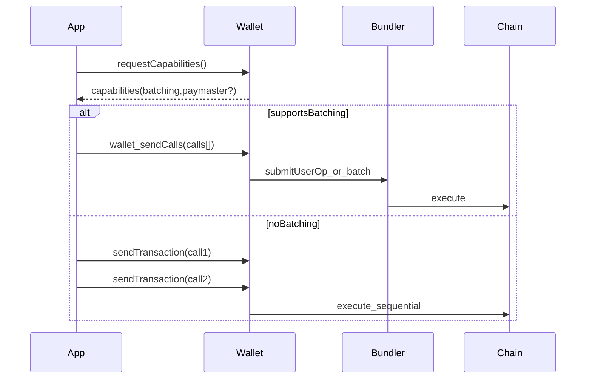

# Account Primitive

The Account primitive is the execution surface: it determines how users authorize multi-step actions and how the system falls back when wallet capabilities are missing.

CreatorVault is designed around:

- **EIP-4337** smart accounts (account abstraction)
- **EIP-5792** wallet call batching (`wallet_sendCalls`)

## Capability Negotiation (High Level)

## Failure Modes

- batching not supported (must fall back to multi-tx UX)
- paymaster unavailable (must fall back to user-paid gas)
- signature/userop issues (debugging + recovery paths)

## References

- [Getting Started](/getting-started)
- [Reference: ERC-4337 Debugging](/reference/erc4337-debugging)

