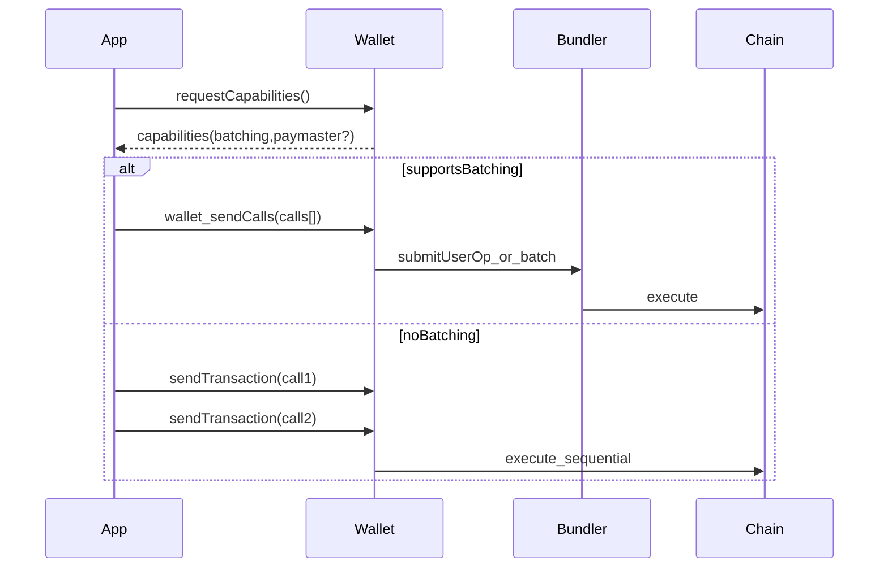

# Account Primitive

The Account primitive is the execution surface: it determines how users authorize multi-step actions and how the system falls back when wallet capabilities are missing.

4626 is designed around:

- **EIP-4337** smart accounts (account abstraction)
- **EIP-5792** wallet call batching (`wallet_sendCalls`)

## Connection methods and the three-tier CSW model

Users enter 4626 through one of three connection methods, each with a different wallet architecture but the same verified-email canonical identity:

- **Coinbase Smart Wallet (Base Account)** — three-tier model: parent CSW (`profiles.csw_address`, passkey-signed, canonical asset account) → app-scoped sub-account (`profiles.base_sub_account`, the user-initiated execution address on `app.4626.fun`) → Privy embedded EOA (`profiles.primary_embedded_eoa`, silent signer for the sub-account). `executionMode: 'canonical'`.
- **External EOA** — single-tier: the user's MetaMask / Rabby / WalletConnect wallet signs directly. `executionMode: 'eoa'`.
- **Telegram Mini App** — identity-link only; wallet setup is deferred to a full browser via the TMA handoff.

Full architecture, state machine, and file references: [4626 Connection Methods](/4626-connection-methods). Canonical wallet invariants: `.cursor/rules/ERC-4337-Wallet-Invariants.mdc`.

## Capability Negotiation (High Level)

## Failure Modes

- batching not supported (must fall back to multi-tx UX)
- paymaster unavailable (must fall back to user-paid gas)
- signature/userop issues (debugging + recovery paths)

## References

- [Getting Started](/getting-started)
- [Reference: ERC-4337 Debugging](/reference/erc4337-debugging)

