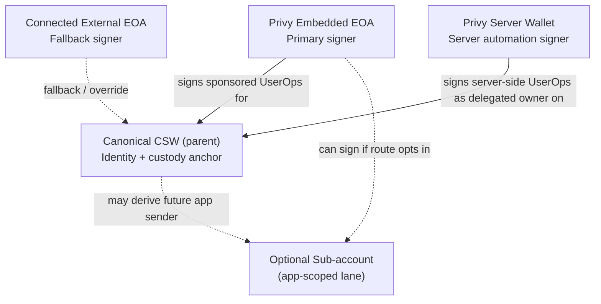
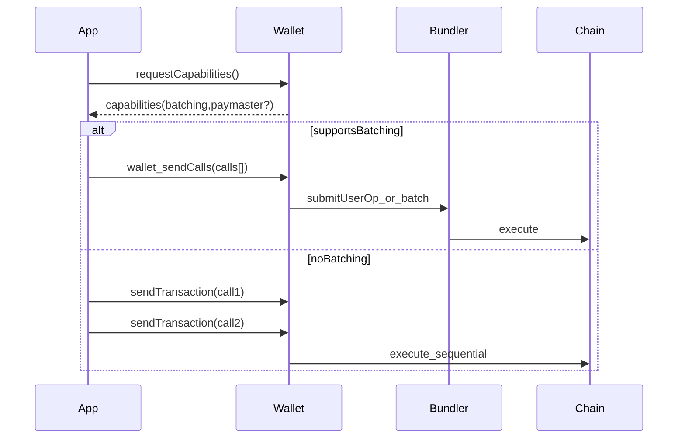

# Account Primitive

> **Canonical reference:** [docs/_internal/ACCOUNT_MODEL.md](../_internal/ACCOUNT_MODEL.md). This page is the docs-site primitive overview; the canonical doc holds the load-bearing invariants and the as-shipped schema.

The Account primitive is the execution surface: it determines how users authorize multi-step actions and how the system falls back when wallet capabilities are missing.

4626 is designed around:

- **EIP-4337** smart accounts (account abstraction)
- **EIP-5792** wallet call batching (`wallet_sendCalls`)

## Connection methods and the three-tier CSW model

Users enter 4626 through one of three connection methods, each with a different wallet architecture but the same verified-email canonical identity:

- **Coinbase Smart Wallet (Base Account)** — parent CSW (`profiles.csw_address`, canonical asset account and sponsored swap sender) signed by the Privy embedded EOA (`profiles.primary_embedded_eoa`) through `canonical4337`. An app-scoped sub-account (`profiles.base_sub_account`) may exist, but it is optional infrastructure rather than the default user-facing execution account. `executionMode: 'canonical'`.
- **External EOA** — single-tier: the user's MetaMask / Rabby / WalletConnect wallet signs directly. `executionMode: 'eoa'`.
- **Telegram Mini App** — identity-link only; wallet setup is deferred to a full browser via the TMA handoff.

Full architecture, state machine, and file references: [4626 Connection Methods](/4626-connection-methods). Canonical wallet invariants: `.cursor/rules/ERC-4337-Wallet-Invariants.mdc`.

## Per-user wallet role chart

For one user, 4626 uses multiple wallets with different jobs. The key split is:

- **Canonical CSW** is identity, custody, and the default sponsored swap sender.
- **Embedded EOA** signs sponsored actions for that smart wallet.
- **Sub-account** is optional app-scoped infrastructure, hidden unless a route actually sends from it.
- **External EOA** is fallback/override.



### Wallet inventory (user-facing model)

| Wallet | Function | Why we use it |
|---|---|---|
| Canonical CSW (parent) | Source-of-truth identity, custody account, and default sponsored swap sender | Stable cross-app identity, ownership anchor, and no balance split |
| Privy embedded EOA | Primary signer for parent-CSW sponsored UserOps | Best UX and reliable in-app signing without repeated passkey prompts |
| Base sub-account | Optional app-scoped execution lane | Future high-frequency route support when the provider is actively used |
| Connected external EOA | Fallback signer / explicit override | Recovery and user-controlled signing path |
| Privy server wallet (delegated owner) | Server-side signing for deploy/session/agent operations | Headless automation while preserving canonical CSW identity |

> Assets and sponsored swap execution stay on the canonical CSW by default. The sub-account is kept out of user-facing copy unless a route actually sends from it.

## Known-good sponsored canonical swap

For sponsored ETH-to-token swaps in canonical mode, the working pattern is:

```text
canonical CSW sender + Privy embedded EOA signature + ERC-4337 paymaster
```

The app wraps native ETH inside the UserOperation (`WETH.deposit()`), approves the Uniswap swap proxy, then swaps through the proxy. The swap proxy call itself must carry zero native ETH value. This preserves sponsorship safety while still letting the user start from ETH in the UI.

Runbook: [Sponsored Canonical Swap Pattern](/operations/sponsored-canonical-swap-pattern).

## Capability Negotiation (High Level)



## Failure Modes

- batching not supported (must fall back to multi-tx UX)
- paymaster unavailable (must fall back to user-paid gas)
- signature/userop issues (debugging + recovery paths)

## References

- [Getting Started](/getting-started)
- [Reference: ERC-4337 Debugging](/reference/erc4337-debugging)

