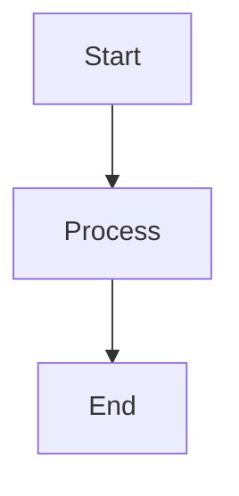

# Diagram Style Guide

Standards for documentation diagrams.

## Mermaid Diagrams

Use Mermaid for flow diagrams:

## Color Scheme

| Element | Color |
|---------|-------|
| Core contracts | Blue |
| User actions | Green |
| Fees/rewards | Orange |
| External | Gray |

## Naming Conventions

- Use full contract names
- Include token symbols where relevant
- Label all arrows with actions

## Best Practices

- Keep diagrams simple
- One concept per diagram
- Use consistent direction (top-down or left-right)
