# Diagram style guide

Standards for Mermaid diagrams in 4626 documentation.

---

## Naming conventions

### Token notation

| Symbol | Meaning | Contract |
|--------|---------|----------|
| TOKEN | Creator coin (underlying) | Zora Creator Coin |
| ▢TOKEN | Vault shares | `CreatorOVault` |
| ■TOKEN | Wrapped shares (OFT) | `CreatorShareOFT` |

In diagrams, use the symbol prefix: `■AKITA`, `▢AKITA`, `AKITA`.

### Contract names

Use short, consistent names:

| Full name | Diagram name |
|-----------|--------------|
| CreatorOVault | Vault |
| CreatorOVaultWrapper | Wrapper |
| CreatorShareOFT | ShareOFT |
| CreatorGaugeController | GaugeController |
| CreatorRegistry | Registry |
| VaultGaugeVoting | GaugeVoting |

---

## Diagram types

### A) System architecture (flowchart TD)

Top-down hierarchy for contract relationships.

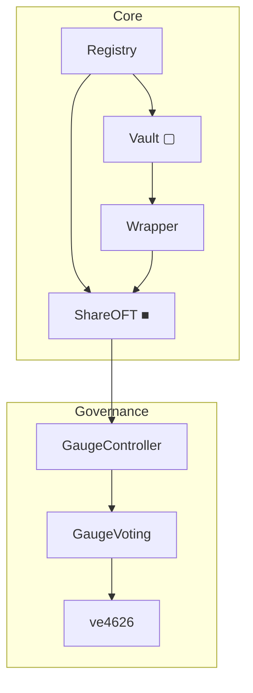

### B) Token flow (flowchart LR)

Left-to-right for processes and transformations.

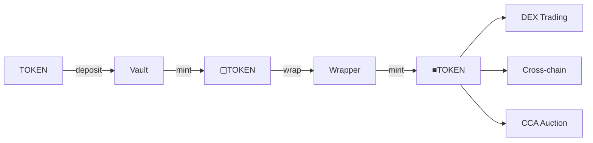

### C) Fee distribution (flowchart TD)

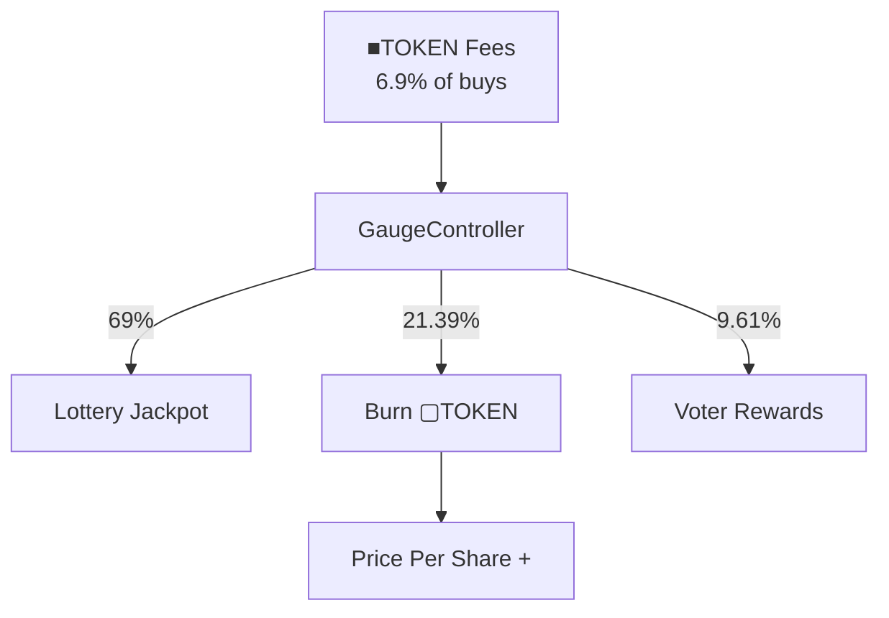

### D) Vault lifecycle (stateDiagram-v2)

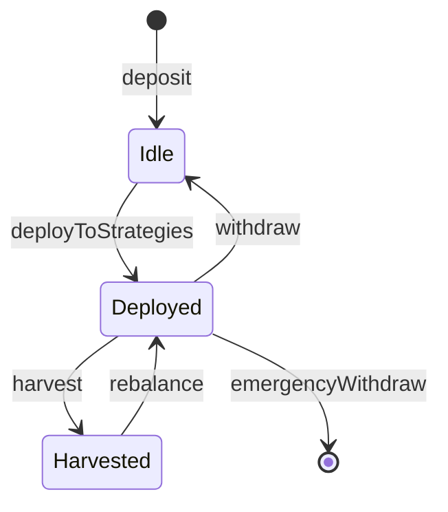

### E) Strategy relationships (flowchart LR)

Shows how the underlying creatorCoin flows to strategies. Note: strategies never receive vault shares.

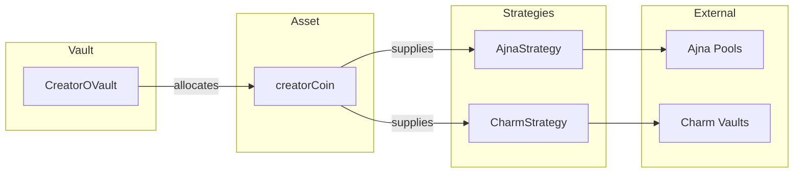

### F) Governance flow (sequenceDiagram)

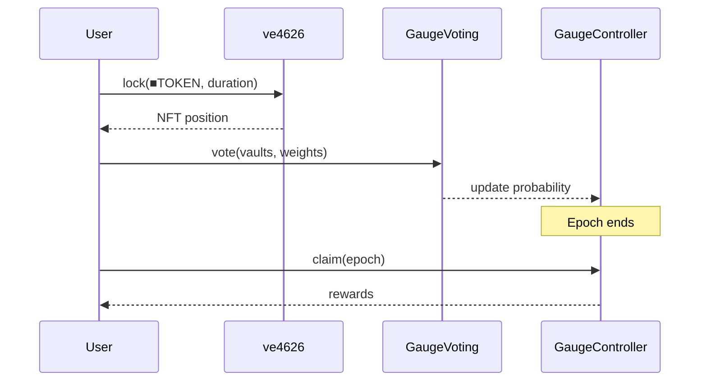

---

## Style rules

### Subgraph grouping

Group related nodes by domain:

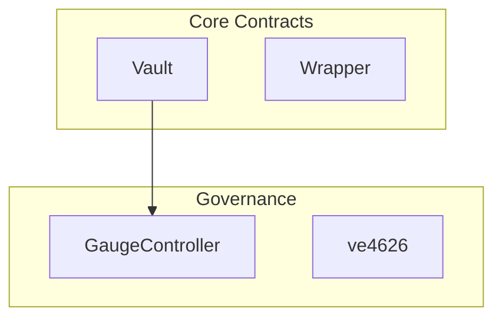

### Node shapes

| Shape | Use for |
|-------|---------|
| `[text]` | Contracts, standard nodes |
| `([text])` | External protocols |
| `{text}` | Decision points |
| `[[text]]` | Subprocesses |

### Edge labels

Keep labels short (1-3 words). Move details to prose.

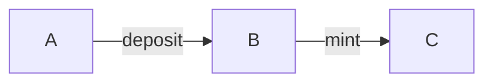

Not:

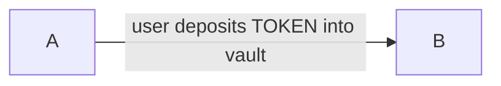

### Colors (optional)

Use sparingly for emphasis:

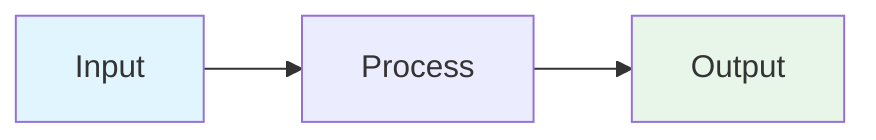

---

## When to use each type

| Diagram type | Use when |
|--------------|----------|
| flowchart TD | Showing hierarchy or ownership |
| flowchart LR | Showing data/token flow |
| stateDiagram-v2 | Showing lifecycle states |
| sequenceDiagram | Showing time-ordered interactions |

---

## Anti-patterns

Avoid these:

1. **Too many nodes** - Split into multiple diagrams
2. **Crossing edges** - Reorder nodes to eliminate
3. **Long labels** - Move to prose
4. **Redundant diagrams** - One diagram per concept
5. **Decorative elements** - Every element must inform

---

## Asset flow rule

> **If a diagram shows ▢[creatorCoin] or ■[creatorCoin] entering a strategy, the diagram is incorrect.**
> **Strategies only ever receive the underlying creatorCoin.**

The canonical asset flow diagram lives in [Architecture](/overview/architecture). All other pages should link to it, not redraw variants.

---

## Diagram categories

Diagrams must belong to exactly one category. Never mix these:

| Category | Shows | Does NOT show |
|----------|-------|---------------|
| **Asset flow** | creatorCoin movement | ▢/■ tokens, governance |
| **Accounting & representation** | ▢/■ token relationships | creatorCoin, strategies |
| **Governance & deployment** | Roles, permissions, lifecycle | Asset flows |

Most confusion comes from mixing categories. If you need to show multiple concerns, use separate diagrams.

---

## Templates

Copy-paste ready templates for common diagrams.

### Minimal token flow

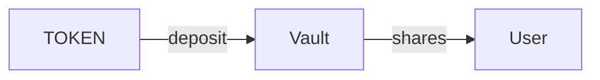

### Minimal fee flow

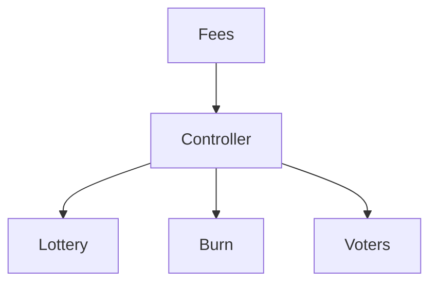

### Minimal architecture

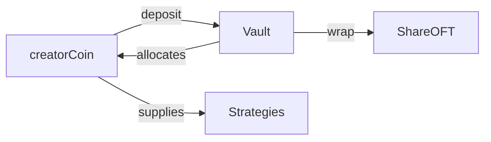

Note: The vault allocates creatorCoin to strategies, not vault shares.
