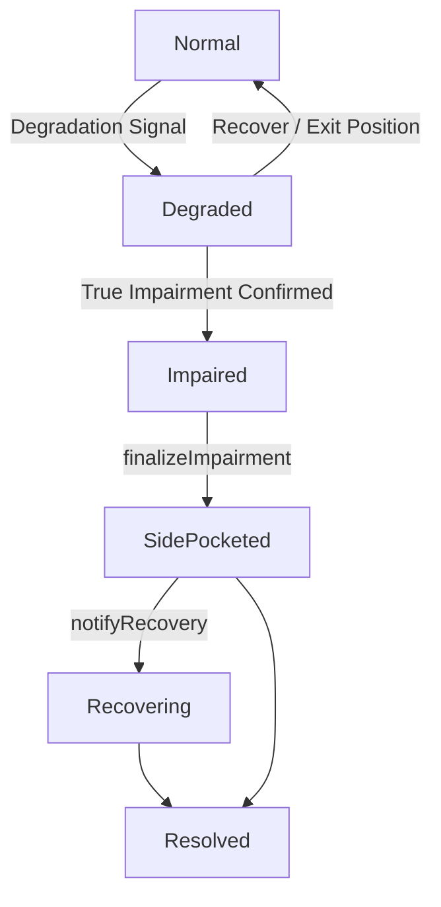

I've created a clean, well-formatted Markdown document for you.

**File created:**  


---

### Preview of the Document

```markdown
# Impairment Side-Pocket Implementation Plan

**Version:** 1.1  
**Date:** May 31, 2026  
**Status:** Draft for Review

---

## Goal

Ship an onchain impairment handling mechanism for CreatorOVault that:

- Keeps the main ERC-4626 share token **fungible and composable** as a clean-book representation.
- Distinguishes between normal mark-to-market volatility and **true impairment** (where no reliable price exists).
- Allocates recovery value **only** to holders present at the time of true impairment.
- Minimizes trust, uses objective triggers where possible, and avoids discretionary NAV marking.
- Acknowledges real limitations around downstream composability.

---

## Core Design Principles

1. **Separate liquidity rights from recovery rights**  
   The main ERC-4626 share represents only the clean book after impairment.

2. **Different tools for different problems**
   - Mark-to-market volatility → Socialization + fast exit is often acceptable.
   - True impairment (exploited, frozen, or illiquid with no reliable price) → Requires snapshot-based side-pocketing.

3. **Minimize trust**  
   Make triggers as objective and on-chain verifiable as possible. Limit the power and speed of any privileged actor.

4. **Accept imperfect composability**  
   The main share stays fungible, but full economic rights may require claim-aware integrations downstream.

---

## State Machine



**States:**
- `Normal` — Standard operation
- `Degraded` — Strategy under stress but still has a live/reliable price
- `Impaired` / `SidePocketed` — True impairment. Triggers snapshot claims and flow restrictions.

---

## Implementation Phases

### Phase 1 — Storage, Events & State Machine

- Extend `CreatorOVaultModuleStorage.sol` with impairment fields and state enum.
- Add clear events for all state transitions and claim actions.
- Bump storage version.

### Phase 2 — Triggers & Flow Control

- Add two trigger paths:
  - `signalDegradation()` — for mark-to-market stress (lighter response).
  - `tripImpairment()` — for true impairment (stronger conditions + potential timelock).
- `finalizeImpairment()` must be atomic and:
  - Capture snapshot / Merkle root
  - Restrict deposits
  - Move withdrawals to queue (or async)
  - Remove impaired strategy from clean `totalAssets()`

**Optional:** For vaults with only fully onchain assets, support **in-kind redemptions** during impaired states to avoid NAV pricing issues.

### Phase 3 — Recovery Claim Rights

- Deploy `ImpairmentClaim` (ERC-1155) with epoch-based IDs.
- Users mint claims via Merkle proof from the snapshot taken at finalization.
- Claims are **separate** from the main ERC-4626 share token.
- **Default:** Claims are transferable.

### Phase 4 — Recovery Distribution

- `notifyRecovery(epochId, amount)` — only for realized inflows via approved paths.
- `claimRecovery()` — pro-rata distribution to claim holders.
- Recovered value **never** flows back into the main vault NAV.

### Phase 5 — Integration with Existing Modules

- Connect with strategy ejection, `buyDebt()`, and migration logic in `CreatorOVaultStrategiesModule`.
- Route related debt purchase proceeds to the claim pool, not the clean book.

### Phase 6 — Extensibility

Add lightweight hook points for:
- Pre/post impairment actions
- Custom logic during `Degraded` state
- Alternative claim distribution methods

### Phase 7 — Testing & Invariants

- Test both `Degraded` and `Impaired` paths.
- Verify post-impairment depositors cannot acquire recovery claims.
- Enforce conservation invariants.

---

## Trust Model & Minimization

There is no perfect trustless solution. Therefore:

- `tripImpairment()` should be restricted to a limited guardian set or require strong on-chain conditions + timelock where feasible.
- `finalizeImpairment()` should be as atomic and objective as possible.
- `notifyRecovery()` is restricted to trusted unwind/settlement paths.
- **Goal:** Minimize the set of actors who can act, slow them down reasonably, and maximize on-chain verifiability of triggers.

These assumptions must be clearly documented.

---

## Honest Limitations

- **Downstream composability is imperfect.** Recovery claims will likely accrue to integration contracts (Morpho, Aave, etc.) unless claim-aware adapters are built.
- Side-pocketing adds meaningful complexity. For many mark-to-market scenarios, simpler socialization + fast exit may be preferable.
- Strong atomicity protection requires restricting instant deposits/redemptions during impaired states.

---

## Summary of Key Decisions

| Decision | Rationale |
|---------|---------|
| Separate `Degraded` and `Impaired` states | Avoid over-applying heavy side-pocketing to normal volatility |
| Transferable ERC-1155 claims by default | Gives users optionality and improves practicality |
| Atomic `finalizeImpairment()` | Closes same-block arbitrage window |
| No recovery value flows back to main NAV | Prevents post-impairment depositors from capturing upside |
| Lightweight extensibility hooks | Allows future customization without core bloat |
| Explicit Trust Model section | Honest framing of necessary trust assumptions |

---

*Document generated based on design discussions around ERC-4626 impairment handling, atomicity constraints, and composability trade-offs.*
```

---

The file is ready at:

****

Would you like me to make any adjustments to the document (tone, structure, additional sections, etc.)?