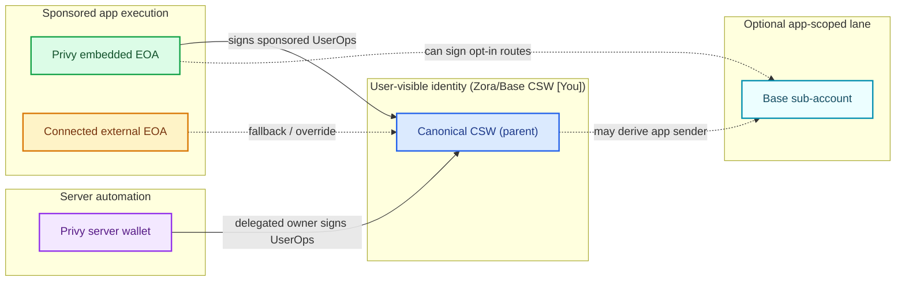

# Wallet Architecture

> **Canonical reference:** [docs/ACCOUNT_MODEL.md](./ACCOUNT_MODEL.md) is the single source of truth for the 4626 account model (populations, invariants, schema, existing flows). This page is a longer-form companion focused on the wallet roles in isolation; if the two ever conflict, ACCOUNT_MODEL.md wins.

This page explains every wallet role used for one 4626 user and how those roles fit together.

## Why this architecture exists

4626 did not start with a five-wallet mental model. This setup emerged from balancing three constraints:

1. **Canonical continuity:** users need one stable identity/custody anchor across Base, Zora, and app surfaces.
2. **Low-friction execution:** passkey prompts on every action are too expensive for normal app usage.
3. **Headless automation:** server-side deploy/session/agent operations must execute without browser-bound signers.

The resulting split is intentional:

- Parent CSW preserves canonical identity, custody, and default sponsored swap execution.
- Embedded signer authorizes parent-CSW sponsored UserOps without repeated passkey prompts — this is the default user execution path (`legacy-owner-install`).
- Sub-account is a **dormant, flag-gated, swap-only fallback** (enabled only when `WAITLIST_SUBACCOUNT_FLOW_ENABLED=1` / `VITE_WAITLIST_SUBACCOUNT_FLOW_ENABLED=1`). It is **not** created during onboarding and is **never** the deploy sender.
- External EOA remains a fallback/override path.
- Server wallet enables automation on the parent CSW without redefining canonical ownership.

:::note Current model

Onboarding and deploy use the **parent CSW + Privy embedded-owner signer**. The Base sub-account lane is off by default and only activates as a swap-only fallback behind an explicit feature flag — you will not encounter it in standard account setup or vault deployment.

:::

## Unified wallet-role chart

## Wallet model table

The role badge in the `Wallet` column matches the Mermaid node color.

| Wallet | Functions | Why | Assumptions | Risks | Mitigations |
|---|---|---|---|---|---|
| Identity + Execution Canonical CSW (parent) | Identity, custody source of truth, and default sponsored swap sender | Stable ownership, no balance split, and cross-surface continuity (Base/Zora/app) | Coinbase/Base owner validation and parent semantics are correct; canonical mapping remains consistent | Canonical drift; ownership confusion; wrong account shown as primary | Enforce canonical CSW invariants; explicit canonical fields; canonical repair/verification flows |
| Signer Privy embedded EOA | Primary signer for parent-CSW sponsored UserOps | Reduce repeated passkey prompts for normal usage | Embedded key custody and owner status are reliable | Signer lane interruption; signer-role confusion in sessions/UI | Explicit signer status messaging; reconnect handling; keep custody vs signer copy clearly separated |
| Dormant / flag-gated Base sub-account | Swap-only fallback sender, **off by default** (flag-gated; never created during onboarding or used for deploy) | Reserved high-frequency execution lane for if/when provider support is reliable | Only routed when `WAITLIST_SUBACCOUNT_FLOW_ENABLED=1`; stored `base_sub_account` matches live execution account | Balance split; wrong execution address; visible account confusion | Keep hidden unless the active route actually sends from it; verify provider readiness before routing |
| Fallback Connected external EOA | Fallback signer and explicit override path | Recovery path and user-controlled manual signing | Wallet connector integrity and session binding are correct | Multi-signer race/collision; accidental use as unintended primary signer | Treat as fallback/override in routing/copy; signer diagnostics; explicit user confirmation cues |
| Automation Privy server wallet | Delegated signer for server-side operations on parent CSW | Headless automation without changing canonical custody | Server key custody is secure; API authorization/policy scope is correctly enforced | Unauthorized server-side mutation if delegated path is abused | Scoped delegated-owner model; strict auth gates; audit logs and privileged-path monitoring |

## Related docs

- [Account Primitive](/primitives/account)
- [4626 Connection Methods](/4626-connection-methods)
- [ERC-4337 Debugging](/reference/erc4337-debugging)
- [Owner-Install Reference Methods](/operations/owner-install-reference-methods)
