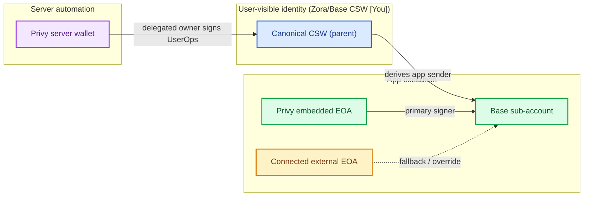

# Wallet Architecture

This page explains every wallet role used for one 4626 user and how those roles fit together.

## Why this architecture exists

4626 did not start with a five-wallet mental model. This setup emerged from balancing three constraints:

1. **Canonical continuity:** users need one stable identity/custody anchor across Base, Zora, and app surfaces.
2. **Low-friction execution:** passkey prompts on every action are too expensive for normal app usage.
3. **Headless automation:** server-side deploy/session/agent operations must execute without browser-bound signers.

The resulting split is intentional:

- Parent CSW preserves canonical identity and custody.
- Sub-account handles day-to-day user execution.
- Embedded signer makes that execution lane practical.
- External EOA remains a fallback/override path.
- Server wallet enables automation on the parent CSW without redefining canonical ownership.

## Unified wallet-role chart

## Wallet model table

The role badge in the `Wallet` column matches the Mermaid node color.

| Wallet | Functions | Why | Assumptions | Risks | Mitigations |
|---|---|---|---|---|---|
| Identity Canonical CSW (parent) | Identity and custody source of truth; parent account in the model | Stable ownership and cross-surface continuity (Base/Zora/app) | Coinbase/Base owner validation and parent semantics are correct; canonical mapping remains consistent | Canonical drift; ownership confusion; wrong account shown as primary | Enforce canonical CSW invariants; explicit canonical fields; canonical repair/verification flows |
| Execution Base sub-account | Default sender for user-initiated app actions | App-scoped execution lane with better day-to-day UX | Sub-account derivation and enforcement are correct; stored `base_sub_account` matches live execution account | Sub-account mismatch; transactions sent from wrong execution address | Persist and verify `base_sub_account`; surface execution address in UI; verification endpoints |
| Execution Privy embedded EOA | Primary signer for sub-account execution | Reduce repeated passkey prompts for normal usage | Embedded key custody and signing isolation are reliable | Signer lane interruption; signer-role confusion in sessions/UI | Explicit signer status messaging; reconnect handling; keep custody vs signer copy clearly separated |
| Fallback Connected external EOA | Fallback signer and explicit override path | Recovery path and user-controlled manual signing | Wallet connector integrity and session binding are correct | Multi-signer race/collision; accidental use as unintended primary signer | Treat as fallback/override in routing/copy; signer diagnostics; explicit user confirmation cues |
| Automation Privy server wallet | Delegated signer for server-side operations on parent CSW | Headless automation without changing canonical custody | Server key custody is secure; API authorization/policy scope is correctly enforced | Unauthorized server-side mutation if delegated path is abused | Scoped delegated-owner model; strict auth gates; audit logs and privileged-path monitoring |

## Related docs

- [Account Primitive](/primitives/account)
- [4626 Connection Methods](/4626-connection-methods)
- [ERC-4337 Debugging](/reference/erc4337-debugging)
- [Canonical CSW Owner Approval](/operations/canonical-csw-owner-approval)
