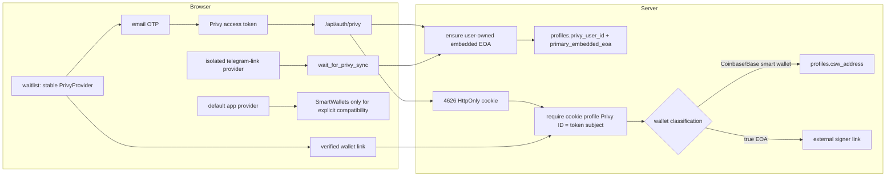

# Privy integration architecture

Privy is the authentication and linked-account backend. Verified email is the
4626 identity and recovery key. `profiles.csw_address` is the canonical parent
Coinbase Smart Wallet for custody and canonical ERC-4337 execution. The Privy
embedded EOA is its signer/owner; it is not the custody account.

## Surfaces

- `default`: stable app-shell provider. Ethereum/Solana embedded wallets use
  `users-without-wallets`. `SmartWalletsProvider` mounts only around an explicit
  non-waitlist compatibility consumer.
- `waitlist`: one provider instance from inline email OTP through wallet link.
  `createOnLogin` is off. Wallet actions use per-action Privy methods without
  changing provider mode, app ID, or client ID.
- `telegram-link`: isolated provider and reducer. Inline OTP keeps the explicit
  `wait_for_privy_sync` phase; the authenticated server path ensures the
  embedded EOA before Telegram binding continues.

## Identity and wallet rules

The OTP token and the HttpOnly 4626 cookie must resolve to the same active
profile before link or unlink persistence. A missing, ambiguous, or mismatched
binding fails closed and asks the user to sign out and authenticate again.

The wallet-link request means “refresh the verified Privy wallet graph.” The
server classifies the result. Coinbase/Base Account smart wallets refresh the
canonical CSW and never become `linkedMethods.external_eoa`; MetaMask, Rabby,
and WalletConnect EOAs remain external signer links. A newly observed smart
wallet does not replace an already persisted canonical CSW.

Whitelabel `loginWithCode` does not run Privy automatic wallet creation.
`/api/auth/privy` and Telegram readiness therefore share one idempotent,
server-owned embedded-EOA ensure path. Waitlist code never calls
`createWallet()` and never mounts `SmartWalletsProvider`.

## Local development

App ID is common to every surface. If a localhost/LAN App Client is enabled,
the same `VITE_PRIVY_CLIENT_ID` is selected by origin for every surface; mode
changes never select another client. Local development uses `auth.privy.io`,
while `*.4626.fun` uses the first-party `privy.4626.fun` API domain.

## Manual verification

1. Fresh localhost browser: complete email OTP, record `/api/accounts/me`
   `privyUserId`, link Base/CSW, and confirm the same ID plus the expected
   `csw_address`.
2. Sign out, use returning-wallet sign-in, and confirm it resolves to the same
   profile without clearing Privy wallets.
3. Continue to `app.4626.fun`; confirm the app shell retains the profile and the
   parent CSW remains the displayed canonical account.
4. Repeat fresh OTP and Base/CSW link on `4626.fun`, then confirm continuity on
   `app.4626.fun`.
5. Open `/telegram/link` from a fresh Telegram Mini App proof. Confirm inline
   OTP, `wait_for_privy_sync`, and final binding remain isolated from waitlist
   routing.
6. On every surface, confirm the parent CSW remains the displayed canonical custody account.

For already-corrupted browser state, sign out and clear site data once before
re-verifying. Clearing Privy wallets is not a normal recovery step.
